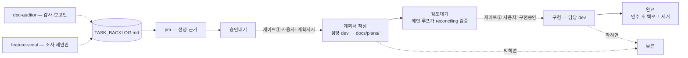

# PROJECT_BOARD

> PM 에이전트가 TASK_BACKLOG.md에서 오늘 처리할 1~2개를 골라 여기에 "승인대기"로 기록한다.
> 단, 미결(`완료`·`보류`가 아닌 것) 항목이 2건 이상이면 새로 기록하지 않는다 — 먼저 진행시키거나 그 행을 지운다.
> 새 섹션은 이 안내 블록 바로 아래(최신순)에 들어간다.
>
> status 전이(전진):
> `승인대기`(PM) → `계획지시`(**사용자만**) → `검토대기`(에이전트) → `구현승인`(**사용자만**) → `완료`·`보류`(에이전트)
>
> 반려(**사용자만**, FEAT-09 이후 대시보드 결재함에서도 가능):
> `검토대기` → `계획지시`(되돌리기 — 계획 재작성) · `승인대기`·`검토대기` → `보류`(사유를 `결과:`에 남긴다) ·
> `승인대기`·`검토대기` → **행 제거**(폐기 — 되돌릴 수 없다. 백로그 항목과 이력 행은 남으므로 수동 정리)
>
> 담당 에이전트는 `계획지시`면 `docs/plans/<항목ID>.md`에 계획서만 쓰고 멈춘다.
> `검토대기` 계획서의 검증은 카탈로그(`docs/plans/verification-paths.md`)의 필수 경로를 소진한 뒤,
> **`plan-verifier`(새 컨텍스트)의 무편집 무소득 패스 1회가 나오면 끝난 것이다.** 메인 루프 자신의
> 무소득 라운드는 트리거(디스패치 자격)이지 판정이 아니다 — 고친 컨텍스트의 재독은 회상과 구분되지 않는다.
> 독립 패스가 3사이클 연속 결함을 내면 계획서 수정으로 풀리지 않는 문제다 — `보류`로 보고한다.
> 재검증은 계획서나 그것이 인용하는 코드가 바뀌었을 때만 돌린다 — FEAT-02에서 클린 패스 뒤에 돌린 4차가
> 아무것도 못 찾았고, 같은 컨텍스트의 무편집 반복도 역대 소득 0건이다(FEAT-08·09·15).
> **`구현승인`이어야 코드를 고친다.** `완료`로 기록할 때 TASK_BACKLOG.md에서도 그 항목을 제거한다.
> `완료` 기록은 재현 검증 후에 받아들인다: 변경 파일 목록 ↔ 계획서 「고칠 파일」, diff ↔ 「구현 스케치」,
> 검증 명령 직접 재실행, 백로그 제거 확인, **`결과`가 가리키는 상세 기록의 실재 확인** — 다섯 다 에이전트의 보고가 아니라 직접 본 것이어야 한다.
>
> **`근거`·`결과`는 각 150자 이내 요약이다.** 상세는 `docs/agents/<행위자>/<항목ID>.md`에 쓴다(규약은 `docs/agents/README.md`).
> `근거`는 행을 만드는 주체가 쓰고 이후 바꾸지 않는다 — pm 선정이면 pm, 소유자 직접 발주면 메인 루프.
> 게이트 결정과 계획서 검증 **라운드 상세**는 이 보드에 쌓지 않고 `docs/agents/main-loop/<항목ID>.md`로 간다.
> 보드에 남는 것은 **요약 판정 한 줄뿐이다** — 메인 루프가 **무편집 클린 패스가 나왔을 때만** `검증:` 줄을 쓴다
> (형식: `검증: 클린 패스 (YYYY-MM-DD, 무편집 N라운드)`). 대시보드 결재함이 이 줄의 **존재만으로** 판정하므로
> (통과=실선 칩, 부재=점선 「검증 전」 칩) 클린 패스가 아닌 상태에 이 줄을 쓰면 거짓 통과가 된다.
> **계획 재작성으로 가는 전이는 이 줄을 지운다** — 대시보드 되돌리기는 코드가(FEAT-13), 직접 편집한
> `검토대기`→`계획지시`와 `보류`→`계획지시` 재개는 사람이 지운다. 남기면 새 계획서에 옛 판정이 붙는다.
> 대시보드가 150자 초과 필드를 화면에 표시한다 — 넘치면 보인다.
> `보류`에서 재개할 때는 계획부터 다시 받으려면 `계획지시`, 기존 계획으로 이어가려면 `구현승인`으로 되돌린다.
> 맨 아래 「파이프라인 구조」 섹션은 정적 구조도다 — 상태 기록이 아니며, 미결 계수에 넣지 않는다.

## 2026-08-29
- [ ] BUG-04: 임시 디렉토리 정리가 파이프라인 성공/실패 여부와 무관하게 항상 실행됨
  agent: backend-dev
  area: apps/backend
  status: 구현승인
  근거: 성공/실패와 무관하게 임시 디렉토리 정리가 항상 실행되는 backend 신뢰성 결함. area가 apps/backend 단일이라 담당 명확. 미결 0건이라 선정 가능.
  검증: 클린 패스 (2026-08-29, 독립 무편집 1라운드 — plan-verifier 3사이클째)
- [ ] BUG-08: 에러 콜백이 `clips: []`를 하드코딩해 부분 성공을 유실함
  agent: backend-dev
  area: apps/backend + apps/web/src/inngest
  status: 구현승인
  근거: 에러 콜백의 clips:[] 하드코딩으로 이미 S3에 오른 앞쪽 클립이 리포트에서 유실. 원 결함은 backend 콜백이라 backend-dev, 웹 inngest 계약 변경은 경계 판단으로 계획 단계에 맡긴다.
  검증: 클린 패스 (2026-08-29, 독립 무편집 1라운드 — plan-verifier 1사이클째)

## 2026-08-28
- [x] FEAT-26: release-verifier 루틴 — 배포 확인 원장의 화면 판정 가능 줄을 매일·배포 직후 자동 확인·마감
  agent: main-loop
  area: .mcp.json + .claude/skills/release-verify (신설) + docs/release-checks.md
  status: 완료
  근거: 소유자 직접 발주(게이트① 세션 지시). FEAT-25 배포·실측으로 선행 의존 해소 — 오늘 손으로 한 스윕을 루틴화해 원장을 자동 마감. main-loop 담당이라 pm 표 밖.
  결과: scripts/release-verify 3모듈+테스트18·루틴 스킬·원장 태그4·계약 사본·package.json·CLAUDE.md. 루틴 생성·즉시 실행: env 부재로 2단계 중단(설계대로, 무변경). 상세 main-loop/FEAT-26
  검증: 클린 패스 (2026-08-29, 독립 무편집 1라운드 — plan-verifier 1사이클째)
- [x] FEAT-25: admin 검증기 인증 경로 — 비밀값 로그인으로 읽기 전용 verifier 세션 발급 (FEAT-26 선행)
  agent: admin-dev
  area: apps/admin/src/server/auth
  status: 완료
  근거: 소유자가 이 세션에서 다음 착수 대상으로 지목. FEAT-26 자동 검증 루틴의 선행 항목이라 먼저 처리한다. 미결 0건이라 선정 가능.
  결과: verifier.ts·next-auth.d.ts·verifier.test 신규3 + config/guard/env/header·쓰기3·테스트2 수정9. check·test 334/75·fsd:final 다 0. 상세 admin-dev/FEAT-25
  검증: 클린 패스 (2026-08-28, 독립 무편집 1라운드 — plan-verifier 1사이클째)

## 2026-08-27
- [x] FEAT-24: 원격 실행의 진행 과정을 대시보드에서 본다 — 루틴의 진행 코멘트 기반 실행 로그 + 대기 중 실행 버튼 잠금
  agent: admin-dev
  area: apps/admin/src/fsd/features/run-pipeline-command
  status: 완료
  근거: 소유자 직접 발주(게이트① 세션 지시). BUG-07 실행 중 pill "무응답"·버튼 재활성으로 진행 여부 판단 불가 — 세션 API 직결 불가 확인 후 #87 진행 코멘트 경로로 등재. 미결 2건째(BUG-07 구현승인 병렬)는 소유자 결정.
  결과: progress.ts running 상태+isRunLocked+진행 코멘트 FIFO 귀속, pill·실행 로그·버튼 잠금 추가. 수정5. check·test 292/62·fsd:final·build 다 0. 상세 admin-dev/FEAT-24
  검증: 클린 패스 (2026-08-27, 독립 무편집 1라운드 — plan-verifier 2사이클째)
- [x] FEAT-23: 항목 카드에 파이프라인 여정 스테퍼 — 전체 단계·현재 위치·다음 단계 표시
  agent: admin-dev
  area: apps/admin/src/fsd/pages/pipeline
  status: 완료
  근거: 소유자 직접 발주(게이트① 세션 지시). 카드가 status 낱말만 보여 여정 위치·다음 단계·대기 주체를 못 읽는다는 관측 — 데이터는 board.ts가 이미 보유, 매핑 순수 모델+스테퍼 UI만 얹는다. 미결 2건째(FEAT-24 검토대기 병렬)는 소유자 결정.
  결과: status→여정 매핑 순수모델(검토대기 이분·완료/보류 여정 밖)+스테퍼 서버컴포넌트를 결재함 카드에 삽입. 신규3·수정1. check·test 307/68·fsd:final 다 0. 상세 admin-dev/FEAT-23
  검증: 클린 패스 (2026-08-27, 독립 무편집 1라운드 — plan-verifier 2사이클째)

## 2026-08-26
- [x] FEAT-22: 파이프라인 보드 읽기의 최대 5분 지연 제거 — raw CDN을 contents API로 교체
  agent: admin-dev
  area: apps/admin/src/fsd/entities/pipeline
  status: 완료
  근거: 소유자 직접 발주(게이트① 세션 지시). 도장 직후 낡은 보드로 실행 버튼 잠김·잠금 칩 "반영 대기" 문구의 공통 원인 제거. 발주 계약은 백로그 FEAT-22. 미결 2건째(BUG-07 병렬)는 소유자 결정.
  결과: queries.ts 읽기를 토큰 시 contents API(fail-closed)·부재 시 raw 폴백으로 교체, 콘솔·잠금 칩 지연 문구 제거. 수정7. check·test 281/60·fsd:final·build 다 0. 상세 admin-dev/FEAT-22

## 2026-08-25
- [x] BUG-07: 폰 뷰포트에서 `/pipeline` "당신의 책상" 배너 라벨이 판독 불가 수준으로 작게 렌더됨
  agent: admin-dev
  area: apps/admin/src/fsd/pages/pipeline
  status: 완료
  근거: FEAT-19 배포 확인 2차 스윕(2026-08-24)에서 실물로 확인된 결함. 미결 0건이라 선정 가능, 가장 최근 발견된 사용자 영향 항목.
  결과: 배너 텍스트를 스케일되는 SVG 좌표계에서 빼내 aria-hidden SVG 위 절대배치 HTML 오버레이(pl-[30.3%]·text-sm/xs 고정)로 이전. owner-banner.tsx 1개 수정, check·test281·fsd:final 다 0.
  검증: 클린 패스 (2026-08-26, 독립 무편집 1라운드 — plan-verifier 2사이클째)
- [x] FEAT-21: 번역 폴백 안내의 웹 절반 — `subtitleStatus` 소비·클립 카드 안내
  agent: web-dev
  area: apps/web/src/app/api/webhooks/modal + apps/web/src/inngest + apps/web/src/fsd/entities/clip + apps/web/src/fsd/widgets/clip-display
  status: 완료
  근거: BUG-02 구현(2026-08-25)이 남긴 범위 밖 의존 — 백엔드는 신호를 보내지만 웹이 버려 사용자 알림이 없다. 함께 선정한다.
  결과: subtitleStatus를 정규화·이벤트·DB쓰기 5지점에 잇고 ClipCard에 amber 폴백 안내 추가. 신규 순수모듈+테스트7. check EXIT0·test 58 pass/0 fail(51→58).
  검증: 클린 패스 (2026-08-26, 독립 무편집 1라운드)

## 2026-08-24
- [x] FEAT-20: 게이트 도장·반려 성공 후 카드 버튼을 「반영 대기」로 잠그기 — CDN 잔상 5분 동안의 재클릭 유도 제거
  agent: admin-dev
  area: apps/admin/src/fsd/features/transition-pipeline-gate
  status: 완료
  근거: 소유자 직접 발주(pm 미경유). 첫 도장 실사용(BUG-03 게이트①)에서 성공 후에도 버튼이 활성으로 남아 재클릭을 유도한 관측 해소. 발주 계약은 백로그 FEAT-20. 미결 2건째(BUG-03 병렬).
  결과: 신규 GateCardLock 컨텍스트로 도장·반려 성공 시 두 화면 카드 버튼을 잠금 칩으로 종결. 신규1·수정7. check·test 278/59·verify:fsd:final·build 넷 다 EXIT 0. 상세 admin-dev/FEAT-20
  검증: 클린 패스 (2026-08-25, 독립 무편집 1라운드 — plan-verifier 2사이클째)
- [x] FEAT-19: 배포 확인 원장 도입 — 완료 항목의 「배포 후 수동 확인」 선언을 모아 마감하는 상태 문서 + 런북 단계
  agent: main-loop
  area: 루트 문서 + docs
  status: 완료
  근거: 소유자 직접 발주(게이트 미경유, FEAT-12 전례로 메인 루프 직접 구현). 완료 항목들의 수동 확인 선언 20곳이 마감 기록 0건으로 쌓이는 관측 해소. 미결 2건 잔존이나 소유자 결정.
  결과: docs/release-checks.md 신설(완료 16건 백필, 마감은 확인·대체·이관 증거로만) + 런북 절차 8단계 삽입·문서 지도 갱신. 코드 무변경. 상세 main-loop/FEAT-19
- [x] FEAT-18: 대시보드 로스터를 현행 파이프라인 7인 체제로 동기화 — backend-dev·plan-verifier가 어드민 세계에 없음
  agent: admin-dev
  area: apps/admin/src/fsd/shared/agents + apps/admin/src/fsd/pages/pipeline + apps/admin/src/fsd/features/run-pipeline-command
  status: 완료
  근거: 소유자 직접 선정. 대시보드 로스터가 현행 파이프라인 7인과 어긋나 backend-dev·plan-verifier가 어드민에 부재한 관측 해소. 미결 2건(BUG-03·BUG-02) 잔존이나 소유자 결정으로 기록.
  결과: 계획서 작성 완료 → docs/plans/FEAT-18.md. 로스터 5→7인(roster·정체성·스프라이트·프로필 라우트·backend-work 명령), plan-verifier는 검토대기 파생·명령 없음. 수정12(신규0). 코드 미변경.
  결과: 로스터 5→7인 편입 — roster·정체성·스프라이트 ledger 소품·backend-work 명령·plan-verifier 검증중 파생. 수정12. check·test 276·verify:fsd:final·build 다 0. 상세 admin-dev/FEAT-18
  검증: 클린 패스 (2026-08-24, 독립 무편집 1라운드 — plan-verifier 2사이클째)

## 2026-08-23
- [x] FEAT-17: 행위자 상세 페이지의 역할 정의를 제목 주도 점진 공개로 — 첫 절만 펼치고 나머지 `##` 절은 접힌 details로
  agent: admin-dev
  area: apps/admin/src/fsd/pages/agent-profile
  status: 완료
  근거: 소유자 직접 발주(pm 미경유). 역할 정의가 지시문 전문 덤프로 렌더되는 관측 해소. 설계 결정 넷·펜스 함정은 백로그 FEAT-17이 원천.
  결과: 역할 정의를 펜스 밖 `##`로 나눠 도입부 카드+절별 접힌 details로 교체(+→× 마커). 수정3. check·test 273/58·verify:fsd:final·build 다 0. 상세 admin-dev/FEAT-17
  검증: 클린 패스 (2026-08-23, 독립 무편집 1라운드 — plan-verifier 2사이클째)
- [x] BUG-03: S3 업로드 실패에 대한 에러 핸들링 부재
  agent: backend-dev
  area: apps/backend
  status: 완료
  근거: 최종 산출물 유실 위험이 가장 큰 backend 신뢰성 결함. 백엔드 항목은 지금껏 한 번도 선정된 적 없고 미결 0건이라 착수 가능.
  결과: 업로드 3곳(en·kr·transcript)을 재시도 래퍼로 감싸고 순수 정책 모듈+테스트 신설. unittest 15/15·py_compile 0. 스케치대로 무차이. 상세 backend-dev/BUG-03
  검증: 클린 패스 (2026-08-24, 독립 무편집 1라운드)
- [x] BUG-02: 한국어 번역 API 실패 시 영어로 조용히 폴백됨 (사용자에게 알림 없음)
  agent: backend-dev
  area: apps/backend
  status: 완료
  근거: BUG-03과 같은 조용한 실패 계열의 대면 결함 — 사용자가 모른 채 영어 결과물을 받는다. 함께 제안한다.
  결과: 폴백 판정을 순수 모듈로 빼 subtitleStatus를 create_korean→콜백까지 실어 조용한 유실 해소. 신규2·수정1(main.py 5지점). unittest 40(기존15+신규25)·py_compile 0. 상세 backend-dev/BUG-02
  검증: 클린 패스 (2026-08-25, 독립 무편집 1라운드)

## 2026-08-20
- [x] FEAT-16: 최종 클립에 선택 근거(hook·payoff·clipType) 저장·표시 — 파이프라인이 보내는데 웹이 버리는 값
  agent: web-dev
  area: apps/web/src/inngest + apps/web/src/fsd/entities/clip + apps/web/src/fsd/widgets/clip-display
  status: 완료
  근거: 소유자 직접 발주(pm 미경유). 백엔드가 클립마다 보내는 hook·payoff·clipType를 웹 파서가 버린다 — 상세는 백로그 FEAT-16. 선행 스키마·마이그레이션은 적용 완료.
  결과: 유실 5지점(파서·이벤트타입·DB create·패치)에 clipType·hook·payoff 복원 + ClipCard 근거 블록 + clip-rationale 순수모듈. 수정5·신규2. check·test 51/12 EXIT 0. 상세 web-dev/FEAT-16.
  검증: 클린 패스 (2026-08-21, 무편집 1라운드)

- [x] FEAT-15: 파이프라인 대시보드에 행위자별 상세 페이지 추가 — 책상 클릭 → 행위자 역할·전체 기록 목록
  agent: admin-dev
  area: apps/admin/src/fsd/pages/pipeline + apps/admin/src/fsd/entities/repo-doc + apps/admin/src/fsd/entities/agent-report
  status: 완료
  근거: 소유자가 방금 추가·오늘 진행 명시 지정, 미결 0건이라 선정 가능. 책상 기록이 개수만 보이고 클릭 진입점 없던 관측 해소.
  결과: 책상 클릭→행위자 상세(역할=정의 frontmatter·기록=뷰어 링크·빈 상태) + shared roster 단일 출처. 신규7·수정4. check·test 264/57·verify:fsd:final·build 넷 다 0. 상세 admin-dev/FEAT-15.
  검증: 클린 패스 (2026-08-21, 무편집 3라운드)

## 2026-08-19
- [x] FEAT-14: `/pipeline` 기록 열람을 대시보드 안에서 — 항목 축 재배치 + 내부 문서 뷰어
  agent: admin-dev
  area: apps/admin
  status: 완료
  근거: 소유자 직접 발주(pm 미경유, 최우선 지정). 기록 열람이 GitHub 이탈로만 가능하고 main-loop 기록은 화면에 안 나온다 — 항목 축 재배치 + 내부 뷰어. 발주 계약은 백로그 FEAT-14.
  결과: 내부 문서 뷰어 라우트 + repo-doc 순수 GFM 렌더러 + 항목 카드 문서 링크 + 책상 '기록 N건'화. 신규 14·수정 11. check·test 247/51·verify:fsd:final·build 넷 다 EXIT 0.
  검증: 클린 패스 (2026-08-20, 무편집 1라운드)

## 2026-08-18
- [x] FEAT-13: 결재함에서 게이트② 승인 전에 계획서 검증 통과 여부가 보이게
  agent: admin-dev
  area: apps/admin + 루트 문서
  status: 완료
  근거: 소유자 직접 지정(pm 미경유). 원격 게이트②에서 검증 통과 여부가 안 보인다 — 상세 관측·대안 셋은 백로그 FEAT-13.
  결과: 검토대기 카드에 부서 칩(검증 통과/검증 전) 추가 — 보드 검증 필드 파서 + bounce 시 줄 제거. 수정 7. check·test 187·verify:fsd:final 셋 다 EXIT 0.
- [x] FEAT-12: 보드 감압 — 상태와 활동 기록의 분리(150자 예산 + `docs/agents/` 규약 + 대시보드 표시)
  agent: admin-dev
  area: 루트 문서 + apps/admin
  status: 완료
  근거: 사후 기록(게이트 미경유). 소유자 발주·제안서 승인 후 메인 루프가 직접 구현.
  결과: 보드 150자 예산 + docs/agents/ 규약. 25파일·182 test·PR #96. 상세: docs/proposals/completed/2026-08-18-board-decompression-and-agent-reports.md

## 2026-08-17
- [x] FEAT-11: `apps/admin/src`에 right-sized FSD 적용 — 동작 보존 구조 이동
  agent: admin-dev
  area: apps/admin/src
  status: 완료
  근거: **이 행은 승인 기록이 아니라 사후 기록이다.** 별도 세션이 제안서와 ADR을 근거로 마이그레이션을 실행했고, 소유자가 사후에 "채택"으로 승인한 뒤 PR #94로 main에 머지했다 — 게이트①②를 거치지 않았고 실행 시점에 보드에 행이 없었다. 그럼에도 남기는 이유는 보드가 작업 상태의 유일한 진실이어야 하기 때문이다. 결정 기록은 `apps/admin/docs/ADR/0001-adopt-fsd-for-admin.md`(status: accepted, 승인 범위 `Core: right-sized FSD migration`, 실행 순서 `fsd-first`), 실행 계약은 `apps/admin/docs/proposals/completed/2026-08-17-admin-src-fsd-refactoring.md`다. **드러난 절차 부채 둘**: (1) 같은 저장소에 두 실행자가 동시에 쓰는 것을 조정하는 장치가 없다 — 메인 루프가 FEAT-10을 검증하는 중에 같은 파일이 덮어써졌다(2026-08-15 FEAT-09 이중 계획 충돌에 이어 두 번째다). (2) 이 작업이 main으로만 갔고 dev가 한 세대 뒤처져 있었다 — 대시보드가 읽는 보드와 파이프라인 작업 브랜치가 전부 dev인데도.
  결과: `apps/admin/src` 62개 파일을 FSD로 이동했다 — `fsd/{entities,features,pages,widgets,shared}`, 인증을 `server/auth/`로 분리, 라우트 그룹 `app/(protected)/`, 슬라이스별 `index.ts` 공개 API, 경계 검사 스크립트 `scripts/verify-fsd-boundaries.mjs`(+ 자체 테스트). 커밋 c286243(94 files, +4764/−477), PR #94 → main. **메인 루프 인수 검증(2026-08-17)**: `npm run check -w apps/admin` 통과(FSD 경계 검사 통과 · ESLint 0 · tsc 0), `npm test -w apps/admin` **128 pass·0 fail**(마이그레이션 전 95에서 증가). 메인 루프가 dev를 main으로 fast-forward해 두 브랜치를 맞췄다(dev가 main의 조상이라 순수 ff, 차이는 이 커밋 하나뿐임을 확인). 후속으로 `apps/admin/docs/proposals/active/admin-src-fsd-contract-hardening.md`가 미결 제안으로 남아 있다 — 별도 항목으로 다룰 것.

## 2026-08-16
- [x] FEAT-10: `/pipeline` 명령 버튼이 무엇을 실행하는지·지금 무엇이 도는지 보이게 — 라벨 명시화 + 실행 상태 표시
  agent: admin-dev
  area: apps/admin
  status: 완료
  근거: 사용자 직접 발주 — pm 경유 없음(소유자 발주로 기록). FEAT-08 첫 실사용에서 소유자가 겪은 마찰 셋(도장 후 화면 무변화 · 「파이프라인 실행」 라벨이 무슨 process인지 말해주지 않음 · 실행 후 돌고 있는지조차 모름)이 발주 사유다. 사용자가 착수 시점을 "FEAT-09 끝나면"으로 지정했고(2026-08-16), FEAT-09가 같은 날 완료돼 조건이 충족됐다 — 미결은 이 항목 1건. 발주 계약은 TASK_BACKLOG.md의 FEAT-10 항목이 원천(관측 셋·요구 넷·가용 신호원 ⓐⓑⓒ·화이트리스트 불변식 제약·범위 밖인 실시간 스트리밍까지 그 안에 있다). **무게중심은 관측 3(실행 가시성)** — 원격 세션이 1~2분 도는 동안 화면이 침묵하고, 답글 없이 삼켜진 명령(2026-08-15 실측)이 성공과 구분되지 않는다. 게이트①은 사용자 지시로 열렸다("FEAT-10에 대한 문서 작성을 시작", 2026-08-16). 주의: `apps/admin/docs/proposals/active/admin-src-fsd-refactoring.md`는 원격 세션이 남긴 미추적·미결정 문서로 계약이 아니다 — 계획은 현재 트리 기준으로 세운다. 계획서 검증(2026-08-17, 2라운드 10부류: 인용 전수 실측·조립 컴파일 0에러·ESLint 0경고·순수 계층 26/26·기존 테스트 110/110 회귀 가드·모의 fetch 서버 액션 6분기·실제 보드 실행·UI 사슬 렌더·Tailwind 방출·WCAG 대비·**이슈 #87 실제 스레드 재생**)에서 **1차에 결함 셋을 실측으로 잡아 반영**했다 — ① 프로토타입 오염 방어 부재(산문은 `Object.hasOwn`이라 했으나 스케치는 인덱스 가드였고, 실행 결과 라벨에 `undefined`가 샜다) ② **삼킴 탐지 주장이 거짓**("최신 명령 뒤 답글 유무" 모델을 2026-08-15 실제 사건으로 재생하니 삼켜진 명령에 `응답 옴`이 떴다 → FIFO 짝짓기로 교체, 재생 결과 `silent(15분)`) ③ 폴링 실패가 조용함(`void tick()`이 거부를 버려 pill이 마지막 값에 얼어붙음). 2차는 계획서에서 코드를 **재추출**해 검증본과 바이트 동일함을 확인하고 전 항목 재실행 — 무편집 클린 패스. **재검증 라운드(2026-08-17, 새 경로 다섯)**: 잘라낸 파일까지 포함한 실제 `apps/admin` 전체 복제에 스케치를 적용해 진짜 tsconfig로 tsc(기준선·패치 후 모두 0에러), 미러가 아닌 실제 eslint 설정으로 `src` 전체 0, 기존 테스트 95/95, `Briefing` 소비자 전수 열거(생성자는 `buildBriefing` 하나뿐이라 필수 필드 추가 안전), 인용 수치·API 계약 재확인 — **결함 넷을 더 잡았다**: ④ `since`가 생성이 아니라 **최종수정** 시각 기준이라 편집된 옛 코멘트가 창에 재진입해 `무응답 4320분` 거짓 경보를 냄(→ `created_at` 창 필터 3줄) ⑤ "실측 하루 8.5KB"가 실은 코멘트 2건 크기(→ 1건당 약 4KB·바쁜 창 8건 30.4KB로 정정) ⑥ 순서 전제가 문서 보장(ID 오름차순)과 어긋남 ⑦ `try/catch` 설명이 세션 만료를 잘못 포함(실제로는 `redirect` → 로그인 이동). **독립 교차검토(별도 컨텍스트, 적대적 지시)는 `PASS`** — 설치된 `next@15.5.7` 소스로 폴링이 페이지 RSC를 재렌더하지 않음까지 확인했다. **3라운드(새 경로 셋: 실제 `next build` 통과·속성 기반 무작위 4만 건 위반 0·발주 계약 대비 요구 충족 감사)에서 결함 하나를 더 잡았다** — ⑧ 도장 직후 안내와 동적 라벨의 모순: raw CDN `max-age=300`(실측) 때문에 도장 후 최대 5분간 투영이 옛 보드라 버튼이 비활성인데, 토스트는 "이제 실행을 누르세요"라 하고 설명은 방금 찍은 도장을 또 찍으라 한다(관측 1을 새 모양으로 재현). 토스트를 "보드에 반영되면 …"으로, 게이트대기 설명에 반영 지연 안내를 더해 결정 5·6과 전 경우 표·테스트 명세까지 전파했다. 요구 충족 감사 결과 그 외 누락 없음(관측 3·요구 4·제약·범위 밖 전부 대응). **4라운드(새 경로 둘: 문서 자기정합성 기계 스캔 — 상호참조·상수·문구 리터럴·표↔스케치 대조 / 구현가능성 감사)에서는 코드 결함 0건**이고 문서 정리 셋만 나왔다: ⑨ 내가 1라운드에 만든 「검증 기록」 절이 `template.md`의 "절을 늘리거나 줄이지 않는다"를 어겼고(기존 계획서 9개 전부에 없다) 이 근거 줄과 두 곳 중복이었다 — 절을 제거하고 기록은 여기 한 곳에 둔다(`docs/plans/README.md:22-23` "기록이 두 곳에 필요하지 않다"). 「디자인 방향」은 `admin-dev.md:50`이 명시적으로 요구하는 인가된 절이라 유지. ⑩ pill 표에 awaiting의 0분 변형 문구가 빠져 있었다. ⑪ pill이 헤더 실행뿐 아니라 **책상 명령 다섯까지 추적한다**는 사실(의도된 동작이나 라벨과 pill이 서로 다른 대상을 가리킬 수 있다)이 계획서에 없었다 — 「디자인 방향」에 명시. ⑫ 불변식 문장의 상호참조가 `§6`을 가리켰으나 실제 위치는 `§4`(구현가능성 감사가 짚음). **구현가능성 감사(별도 컨텍스트)도 `PASS`** — before/after 조각 전수 바이트 일치, 임포트 심볼 실재, 검증 명령 실재, 사용자 노출 문구 4중 정합(산문↔스케치↔전 경우 표↔테스트 명세)을 확인했다. 5·6라운드(변경 대조·규약 선례·템플릿 준수·이력 행 전체 사슬 6경우)는 날짜 표기 1건 외 소득 없음. **7라운드 — 돌연변이 검사(새 부류)에서 테스트 명세의 구멍 하나를 찾았다**: 명세를 실행 가능한 25건으로 옮겨 스케치에 오류 일곱을 심었더니 여섯은 잡혔으나 **"가장 오래된 미응답 → 가장 최근 미응답" 변경이 25건을 전부 통과했다.** 동시 미응답 2건짜리 단언이 명세에 없었기 때문이다. 그 구현은 2026-08-15 재전송 시점에 `silent(15분·이슈 #87 확인)` 대신 `awaiting(0분)`을 띄워 이 항목의 핵심 신호를 잃는다(실측). 명세에 해당 단언을 더해 일곱 전부 잡히는 것을 확인했다(26/26). **8라운드 — 돌연변이를 16종으로 확장해 구멍 셋을 더 찾았다**: (a) 게이트대기 케이스가 승인대기·검토대기를 한 번에 묶어 놔서 `GATE_WAITING`에서 한쪽이 빠져도 통과했다 — **검토대기만 있는 보드는 지금 실제 상태**라 상시 경로다 (b) `Math.max(0, …)` 음수 클램프에 단언이 없어 시계 어긋남 시 "−1분째"가 뜨는 구현이 통과했다 (c) `[claude]` 판정이 접두(`startsWith`)임을 고정하는 단언이 없어 `includes` 구현이 통과했다(본문 중간에 그 낱말이 든 명령을 답글로 오인 → 거짓 초록). 셋을 명세에 더해 29/29, 전 돌연변이 사멸 확인. `if (it.status === null)` 가드 제거는 살아남았으나 **`tsc`가 타입 에러 3건으로 잡으므로**(`npm run check` 포함) 명세 구멍이 아니다. 최종 재추출 패스에서 편집 0건. **게이트②(2026-08-17): 사용자가 `구현 승인`.** 추가 결정 없이 계획서 기본값 그대로 간다 — 진행 신호원 ⓐ 코멘트 폴링(15초)·FIFO 짝짓기·임계 3분·상태 다섯·동적 라벨과 도장 직후 안내 카피·CDN 잔상 범위 밖·`getPipelineProgress` public root 미재수출·경계 fetch owner 3→4. 이동 전 8라운드 + FSD 10라운드(총 결함 22건 수정, 마지막 넷 중 셋이 무수정)를 거쳤고, 구현 예행에서 20파일·40suite·173test가 통과했다.
  결과: 계획서 작성 완료 → docs/plans/FEAT-10.md. 헤더의 정적 「파이프라인 실행」을 동적 실행 콘솔(라벨·설명은 보드 status에서 결정적 도출: 계획지시→"FEAT-xx 계획서 작성"·구현승인→"FEAT-xx 구현"·복수→"외 N건"·여집합(게이트대기만/완료·보류/빈)→비활성 "진행할 작업 없음")로 승격하고, 진행 신호는 **ⓐ 이슈 #87 코멘트**를 15초 폴링(실측 비교: 명령·답글이 둘 다 소유자 계정이라 유일 구분자는 `[claude]` 접두 — ⓐ만 삼킨 명령을 판별; ⓑ 보드 status는 게이트 미전이+CDN 지연, ⓒ 커밋은 1:1 아님 → 기각). 판별은 **명령:답글 FIFO 짝짓기**이며(검증 1차에서 "최신 명령 뒤 답글 유무" 모델이 삼킴 사건에 거짓 초록을 내는 것을 실측해 교체), 상태 다섯(요청 보냄/응답 옴/무응답≥3분/idle/unknown, 임계는 실측 정상 0.3~2.6분 위)으로 pill 표시. 도장 직후 토스트에 다음 행동 안내를 이어 결정≠실행을 명시(FEAT-08 자동 게시와 다름). 화이트리스트 불변식 유지(라벨만 동적·본문은 commands.ts 고정, 클라는 key만), DB 무접근·외부 쓰기 둘 유지(진행은 읽기, 신규 PAT 권한 불필요). CDN 잔상은 범위 밖(후속 항목). 신규 6(run-plan·progress·progress-action·pipeline-run-control + 테스트 2)·수정 5(briefing·briefing.test·pipeline-page·pipeline-gate·env.js 주석).
  **정정·재계획(2026-08-17)**: 위 근거의 "FSD 제안서는 미결정 문서라 계약이 아니다"는 그 시점엔 사실이었으나 **지금은 아니다** — 사용자가 채택했고 FEAT-11로 완료됐다(같은 날). 그 결과 이 계획서는 FSD 트리(`src/fsd/**`)를 대상으로 **다시 쓰였다.** 메인 루프가 대조한 결과 **8라운드에 걸쳐 잡은 수정 열여섯이 전부 보존됐고**(FIFO 짝짓기·`Object.hasOwn` 방어 둘·폴링 `try/catch` 강등·본문 파싱 포함 실패 처리·`created_at` 창 필터·"보드에 반영되면" 카피·게이트대기 5분 안내·pill 0분 변형·책상 명령 추적 명시·미응답 2건 단언·승인대기/검토대기 분리·시계 어긋남·`startsWith` 접두·`sinceIso` 근거 주석), before 조각 여덟 개가 **새 트리에 그대로 적용된다**(§7이 두 파일을 한 절에 담아 첫 대조에서 하나가 어긋나 보였으나 `gate-transition-button.tsx:38`에 정확히 존재). 구조 변화: `gateNextActionHint`가 FSD 경계(peer feature 임포트 금지) 때문에 gate feature 소유로 옮겨져 상수명이 `GATE_NEXT_DELIVERABLES`가 됐고, 신규 파일 4개는 `features/run-pipeline-command/{model,api,ui}` 아래로 간다. **FSD 재검증(2026-08-17, 메인 루프)**: 새 트리 기준으로 다시 돌려 **결함 다섯을 잡았다** — ⑬ §5 첫 블록이 적용 불가능(before가 실제 파일과 다르고 — `briefing.ts:2`의 `isGateTransitionSource` 누락, `known-agents` 임포트는 실제로 여러 줄 — before 안에 아직 없는 새 임포트가 들어가 있고 after가 비어 있었다) ⑭ **이동 전 줄번호가 그대로 남음**(§6의 `:8·:41·:55`는 옛 flat 트리 좌표, 실제는 `:3·:45·:59`; §5의 `:22-28`·`:195-205`도 실제 `:27-33`·`:199-209`) ⑮ 「현재 동작」의 `파일:줄` 근거가 39건→8건으로 사라짐(템플릿이 명시 요구) ⑯ **스케치가 lint를 통과하지 못함** — `get-pipeline-progress.ts`에서 `Array.isArray`가 `unknown`을 `any[]`로 좁혀 `@typescript-eslint/no-unsafe-*` 4건(계획서 자신이 "lint 0 exit"을 성공 기준으로 못 박았는데) ⑰ §7의 두 블록이 before/after가 아니라 기계적 적용·검증이 불가능했고 실제로 조립을 깨뜨렸다. 다섯 다 고친 뒤 재조립: 패치 10/10 기계 적용, `tsc` 0, 실제 eslint(src+scripts) 0, `verify:fsd:test` 11/11, `verify:fsd`·`verify:fsd:final` 통과(fetch owner 4), 기존 테스트 128/128 회귀, 계획서 명세 실행 통과, 돌연변이 6종 전부 사멸(구조 이동 후에도 8라운드 명세 강화가 유효). 참고: 계획서 머리말이 별도 세션의 `clean pass achieved`를 적어 두었으나 위 다섯은 그 뒤에 남아 있던 것이다. **FSD 2라운드(새 경로 넷)**: 계획서가 명세한 `get-pipeline-progress.test.mjs`를 **실제로 작성해 실행**(15/15 통과 — 인가 우선·정확한 이슈 URL·6시간 `since`·`per_page=100`·`no-store`·선택적 Bearer·전송/status/JSON 실패·top-level non-array·member 5분류·부분 집계 금지·`created_at` 창 필터·FIFO 전달), 경계 검사 **음성 시험**(§9의 owner 등록을 빼면 `[R13] network call is outside the approved fetch owners`로 **종료코드 1** — §9는 장식이 아니다), public API 교체가 순증분임 확인(기존 셋 보존 + 신규 둘, 깨질 임포트 없음), **프로덕션 빌드 통과**(`/pipeline` 4.62 kB / First Load 124 kB). 전체 테스트 143/143. 결함은 하나뿐이었다 — ⑱ 테스트 명세가 `server-only` module mock을 지시했으나 불필요하다(이 액션은 직접 import하지 않고 유일한 import처 `guard.ts:1`은 통째로 mock되며, 기존 액션 테스트 셋도 mock하지 않는다). 정정 후 재조립: 패치 10/10, tsc 0, eslint 0, `verify:fsd:final` 0, 143/143. **FSD 3라운드(새 경로 둘)**: 새 경로에서의 Tailwind 방출 검침(pill 색·`size-2`·`max-w-64`·`animate-pulse`·`motion-reduce`·`flex-wrap` 전부 HIT — 이동이 방출을 깨지 않았다)과 FSD 규약 문서 대조. 결함 하나 — ⑲ 코멘트 read를 `features/run-pipeline-command/api`에 두는 근거가 없었다. 규약 「서버 데이터 접근 배치 규칙」 1은 "단일 도메인 엔티티 조회는 `entities/<domain>/api/`"라 하고 형제 함수 `getPipelineBoard()`가 실제로 거기 있어, 나중에 "정리"하려는 사람이 옮길 수 있다. 실측으로 그게 **구조적으로 불가능**함을 확인해(entities로 옮기면 `deriveProgress` 상향 임포트가 되어 `[R1] entities cannot import upward from features`, 종료코드 1) §3에 근거를 남겼다. 계획서는 `gateNextActionHint`의 gate feature 소유권은 설명하면서 이건 빠뜨렸다. 반영 후 재조립: 패치 10/10, tsc 0, eslint 0, `verify:fsd`·`--final` 0, 경계 규칙 테스트 11/11, 기존 테스트 128/128. **FSD 4라운드(새 경로 셋)**: 마이그레이션이 다시 쓴 `apps/admin/CLAUDE.md`(166줄 변경)·`.claude/agents/admin-dev.md` 대조, 그리고 미결 제안 `admin-src-fsd-contract-hardening.md`와의 충돌 점검. 제안은 `stage: awaiting-approval`이고 제외 범위에 "FEAT-10 기능 구현"을 명시해 충돌 없음. CLAUDE.md 테스트 인벤토리(17파일·35suite·128test)도 실측과 일치. 결함 하나 — ⑳ **handoff가 절반만 지시했다**: 계획서는 경계 스크립트 fetch owner를 3→4로 올린다고 적으면서, 같은 사실을 열거하는 `CLAUDE.md:99-101`(raw board GET·command POST·gate GET/PUT) 갱신은 handoff에 넣지 않아 구현 후 워크스페이스 지시 문서가 코드보다 낡게 된다. handoff를 두 항목(테스트 인벤토리 + 소유권 목록)으로 나누고, 바로 아래 "GitHub 쓰기 두 경로" 문장은 새 owner가 읽기이므로 **고치지 않는다**는 것까지 명시했다. 재조립: 패치 10/10, tsc 0, eslint 0, `--final` 0, 128/128. **FSD 5라운드 — 결함 0건(계획서 무수정).** 새 경로는 **완전 구현 예행**이었다: 계획서가 명세한 테스트 3개(`run-plan`·`progress`·`get-pipeline-progress`)를 전부 작성하고 기존 2개(`transitions`·`briefing`)를 명세대로 수정해 넣은 뒤 전 배터리를 돌렸다 — **173 test / 40 suite / 20 파일 전부 통과**(현재 128/35/17에서 증가), 경계 규칙 11/11, `verify:fsd`·`--final` 0, tsc 0, eslint 0. 이로써 계획서의 두 주장이 실증됐다: `briefing.test.mjs`의 기존 단언이 `plan` 필드 추가로 깨지지 않는다는 것, `transitions.test.mjs`의 기존 forward/reject 테스트가 유지된다는 것. 또 `verify:fsd:final`이 "금지된 client/page/shared fetch 0개"를 실제로 강제함을 확인했다(page UI·client UI에 각각 fetch를 심으니 `[R13]` + owner 불일치 expected 4/actual 5로 종료코드 1). `REQUIRED_FINAL_FILES`는 존재 요구 목록이라 신규 파일이 깨지 않는다. **구현 시 보고할 handoff 수치는 20파일·40suite·173test다.** **FSD 6라운드(새 경로 둘)**: 폴링 race 실측과 액션 파일 커버리지 계측. race는 계획서가 「못 덮는 범위」에 "마지막으로 시작한 request만 반영되는지"라 적어 둔 성질인데, 스케치에 실제로 `progressRequestRef` 순번 가드가 있고 제어흐름 재현에서 세 시나리오 모두 통과했다(옛 poll이 늦게 도착해도 안 덮음 · 옛 요청이 늦게 reject돼도 `unknown`으로 안 내려감 · 가드 없는 대조군은 실제로 덮임). 결함 하나 — ㉑ 액션 테스트 명세가 shape 실패의 "필드 누락"을 **한 케이스로 뭉쳐** `"body" in value`의 거짓 분기를 아무도 밟지 않는다(실측 branch 96.43%에서 정지). `body` 누락과 `created_at` 누락을 나누도록 명세를 고쳤고 그러면 **line·branch·function 100%**가 된다(16/16). 반영 후 재조립: 패치 10/10, tsc 0, eslint 0, `--final` 0, 128/128. **FSD 7라운드 — 결함 0건(계획서 무수정).** 액션 파일에 돌연변이 12종(창 필터 무력화·경계 `>=`→`>`·status 검사 제거·non-array→idle·NaN 가드 제거·`per_page` 30·창 12시간·`no-store` 제거·Bearer 조건 반전·잘못된 member 건너뛰기(부분 집계)·인가 호출 제거·`createdAt` 타입검사 제거)을 심어 **전부 사멸** — 6라운드에서 100%로 만든 커버리지가 분별력까지 갖췄음을 확인했다. 또 "feature root는 Server Action을 재수출하지 않는다"가 규율이 아니라 **기계 강제**임을 확인했다(재수출하면 `[R11] feature roots must not re-export Server Actions`). **FSD 8라운드(새 경로 하나)**: FSD 판에 대한 문서 자기정합성 기계 스캔(상호참조·상수·사용자 노출 문구 코드↔산문·표↔스케치·절 구조). 상호참조 전부 해석되고 상수 다섯 일치, 절 구조는 템플릿 7절 + `admin-dev.md:50`이 요구하는 「디자인 방향」뿐. 결함 하나 — ㉒ **실행 버튼 성공 토스트가 스케치에만 있고 「디자인 방향」에 없었다.** 구현 후 헤더는 `파이프라인 실행을 요청했습니다 (이슈 #87). 아래에서 진행을 확인하세요.`, 책상 다섯은 기존 `실행 요청을 보냈습니다 (이슈 #87)`로 **같은 이슈에 명령을 보내는 두 버튼이 다른 말을 한다**(`pipeline-command-button.tsx:28`은 「고칠 파일」에 없다). 의도된 차이지만 — 헤더 토스트만 바로 아래 pill을 가리킬 수 있다 — 계획서가 pill의 같은 채널 비대칭은 설명하면서 토스트는 빠뜨렸다. 「실행 직후 안내(카피)」 절을 도장 카피 옆에 더했다. 재조립: 패치 10/10, tsc 0, eslint 0, `--final` 0, 128/128, 두 토스트 공존 확인. **FSD 9라운드 — 결함 0건(계획서 무수정).** 새 경로는 **UI 실물 렌더**였다 — 지금까지 FSD 트리에서 컴파일·린트·빌드만 했지 컴포넌트를 실행한 적이 없었다. 서버 액션 둘을 module mock하고 `PipelineRunControl`을 `renderToStaticMarkup`으로 렌더해 5/5 통과: 이동된 임포트(`~/fsd/shared/ui/atoms/button`·`~/fsd/shared/lib/utils`)가 런타임에 해석되고, 활성/비활성 마크업(`disabled` 유무·동적 라벨·5분 안내)·초기 pill(`진행 상태 확인 불가`+`bg-muted-foreground`)·레이아웃 클래스(`flex flex-col items-end gap-1.5`·`max-w-64 text-right`·`size-2 rounded-full`)·점의 `aria-hidden`이 「디자인 방향」과 일치했다. (`jsx: preserve` 때문에 tsx 러너에서 `React is not defined`가 나는 것은 하니스 사정이며 Next 파이프라인과 무관하다.) **FSD 10라운드 — 결함 0건(계획서 무수정).** `파일:줄` 인용 22건을 **줄 존재가 아니라 내용까지** 기계 대조해 불일치 0(대조 스크립트가 처음에 `apps/web`의 동명 `globals.css`를 잡아 오탐을 냈고, 손으로 확인해 admin의 83~90줄이 브리핑 토큰 블록임을 확정했다). 오늘의 실제 보드(FEAT-11 완료·FEAT-10 검토대기·나머지 완료/보류)로 전 사슬을 돌려 비활성 + 도장 안내 문구가 정확히 나오는 것도 확인했다.
  결과: **구현 완료(2026-08-17, 게이트②).** 계획서 스케치를 그대로 이식해 헤더 정적 「파이프라인 실행」 버튼을 동적 실행 콘솔(보드 status에서 도출한 동적 라벨·설명 + 이슈 #87 코멘트 15초 폴링 진행 pill 다섯 상태)로 승격하고, 도장/실행 직후 안내 카피를 얹었다. 신규 7: `src/fsd/features/run-pipeline-command/model/{run-plan.ts,run-plan.test.mjs,progress.ts,progress.test.mjs}`·`api/{get-pipeline-progress.ts,get-pipeline-progress.test.mjs}`·`ui/pipeline-run-control.tsx`. 수정 10: 같은 feature `index.ts`, `src/fsd/pages/pipeline/model/{briefing.ts,briefing.test.mjs}`·`ui/index.tsx`, `src/fsd/features/transition-pipeline-gate/model/{transitions.ts,transitions.test.mjs}`·`ui/gate-transition-button.tsx`, `src/env.js`(주석), `scripts/verify-fsd-boundaries.mjs`(production fetch owner 3→4)·`verify-fsd-boundaries.test.mjs`. 검증(직접 실행, 넷 다 0 exit): `npm test` 173 pass·0 fail(20파일·39suite — 예행 40suite는 describe 그룹핑 차이일 뿐 test 수 173 일치), `npm run check` EXIT 0(verify:fsd:test 12/12·verify:fsd migration·ESLint 0경고·`tsc --noEmit` 0), `npm run verify:fsd:final` EXIT 0(fetch owner 정확히 4), `SENTRY_DISABLE_AUTO_UPLOAD=true npm run build` EXIT 0(`/pipeline` 4.64 kB·First Load 125 kB). 스케치 대비 차이: 프로덕션 코드 없음(분기·조건·리터럴·사용자 노출 문구 전부 스케치대로 바이트 이식; `Object.hasOwn` 방어 둘·FIFO 짝짓기·`try/catch`+`progressRequestRef` 가드·`created_at` 창 필터·owner 3→4 원자 반영 준수). 테스트 3종은 계획서 「테스트」 절 명세대로 자작(스케치가 코드를 주지 않음) — 필수 분리 케이스 전부 포함(승인대기만/검토대기만 각각·미응답 2건 동시·shape의 body누락/created_at누락 각각·시계 어긋남 minutes:0·본문 중간 [claude] startsWith). 못 덮음(Node 러너·DOM/외부 I/O 없음): `PipelineRunControl` 폴링·useTransition·토스트·disabled, `ProgressPill` 시각(점 색·awaiting 맥박·motion-reduce·색-낱말 이중 전달·text-xs 대비), 헤더 flex-wrap 반응형·설명 max-w-64, 폴링 race(가드는 제어흐름 재현으로 확인), `per_page=100` 상한, CDN 잔상(결정 6·후속 항목) — 배포 후 데스크톱+폰 수동 확인. 비고(읽기 전용 `apps/admin/CLAUDE.md` → 메인 루프 동기화): (1) 「테스트 인벤토리」(:35) 17→20파일·35→39suite·128→173test, 신규 3행 — `…/run-pipeline-command/model/run-plan.test.mjs`(동적 라벨 전 경우·프로토타입 오염 방어)·`…/model/progress.test.mjs`(FIFO 짝짓기·상태 다섯·시계/접두 경계)·`…/api/get-pipeline-progress.test.mjs`(auth-first·6h since·창 필터·shape fail-closed·FIFO 전달). (2) 「데이터와 외부 효과 소유권」(:99-101)에 네 번째 owner 한 줄 추가 — `progress GET owner는 src/fsd/features/run-pipeline-command/api/get-pipeline-progress.ts다`; 바로 아래 "GitHub 쓰기 두 경로…" 문장은 새 owner가 읽기라 그대로 둔다.
- [x] FEAT-09: `/pipeline` 결재함에 반려 경로 — 게이트 거절을 대시보드에서
  agent: admin-dev
  area: apps/admin
  status: 완료
  근거: 사용자 직접 발주 — pm 경유 없음(소유자 발주로 기록). FEAT-08이 승인(도장)만 만들고 거절 수단을 남기지 않아, 계획 반려·항목 보류·폐기가 전부 대시보드 밖에서만 가능하다(FEAT-01을 내리는 데 실제로 수동 처리가 필요했다). 발주 계약은 TASK_BACKLOG.md의 FEAT-09 항목이 원천 — 거절 세 갈래(되돌리기·보류·폐기)의 구분, FEAT-08 화이트리스트 재사용, 사유 기록, 폐기의 비가역성 취급을 계획 단계에서 판단해야 한다. FEAT-01은 같은 날 보류로 내려 미결은 이 항목 1건이다. **게이트①은 대시보드 도장 버튼으로 열 예정 — FEAT-08 원격 쓰기 경로의 첫 실측을 겸한다.** 계획서는 검증 7라운드 12부류(인용 실측·조립 컴파일·순수 계층 27/27·서버 액션 8/8·UI 사슬 렌더·대비 실측 5.58:1·여집합 열거·Tailwind 방출·독립 교차검토·브리핑 사슬 실행·실제 보드 실행·서버 액션×실제 보드 E2E)를 거쳐 6·7라운드 연속 무편집 클린 패스. 게이트② 결정(2026-08-16): 보류 사유 고정 문구 · 폐기는 보드 행만(백로그는 토스트 안내) · 폐기 잉크 oklch(0.50 0.20 27) 승인 · 되돌리기 재작성은 admin-dev 기존 규칙 위임 · 계획지시·구현승인 반려는 넣지 않음 · **보드 안내 블록에 반려 세 전이를 기재한다(메인 루프가 구현 완료 후 처리)**.
  결과: FEAT-08 도장 옆에 거절 세 갈래(되돌리기·보류·폐기)를 얹었다. `transitions.ts`에 `locateItem` 헬퍼를 추출해 `applyGateTransition`을 동작 보존 리팩터하고, 그 위에 반려 화이트리스트 `REJECT_TRANSITIONS`(bounce 검토대기→계획지시·hold 승인대기·검토대기→보류·discard 승인대기·검토대기→행 제거)와 순수 함수 `rejectActionsFor`·`applyBounceTransition`·`applyHoldTransition`(결과 줄 있으면 교체·없으면 근거 뒤 삽입, 리터럴 슬라이스로 `$` 안전)·`applyDiscard`·`holdResultLine`·`rejectCommitMessage`를 더했다. `commit-transition.ts`는 GET→편집→PUT 왕복을 `commitBoardEdit(makeEdit)`로 추출해 승인·반려가 공유하고 `commitRejectTransition`이 action을 서버에서 화이트리스트로 재검증한다(requireAdmin은 각 export try 밖 최상단 유지). UI는 도장과 형태로 대비되는 여백 펜 메모(평평·산세리프·회색 접힘) `RejectActions`를 신규 작성했고 폐기만 인라인 확인 3동작이다. 신규: src/ui/pipeline-reject.tsx. 수정: src/pipeline/transitions.ts·transitions.test.mjs·commit-transition.ts, src/ui/pipeline-page.tsx. 검증: `npm run check -w apps/admin` 통과(ESLint 0·tsc 0), `npm test -w apps/admin` 95 pass·0 fail(transitions.test.mjs +26: rejectActionsFor·bounce/hold/discard 해피패스·파서 왕복·최소 diff·다중 등장 최신 행만·거부 4사유·`$` 리터럴 삽입·재보류 교체·holdResultLine 고정날짜·rejectCommitMessage 3종; 기존 FEAT-08 12테스트가 리팩터 회귀 가드로 통과). 스케치 대비 분기·조건·리터럴·문구 차이 없음 — 서버 액션은 별도 파일이 아니라 `commit-transition.ts` 안 `commitRejectTransition`이다(계획서 「고칠 파일」 표·스케치 §2와 일치). 재보류 테스트만 기존 BOARD 픽스처의 FEAT-05에 결과 줄을 인라인으로 더해 구성(새 픽스처 없음). 못 덮음(Node 러너·DOM/외부 I/O 없음): commitBoardEdit GET/PUT·base64·sha 409·requireAdmin·commitRejectTransition action 분기, RejectActions useState/useTransition/toast/router.refresh·여백 펜 메모 시각·폐기 확인 잉크 oklch(0.50 0.20 27) 12px AA 실측·마커 3:1·투영 지연 — 배포 후 데스크톱+폰 수동 확인. 비고(읽기 전용/쓰기 범위 밖 → 메인 루프): apps/admin/CLAUDE.md 테스트 수 69→95·transitions.test.mjs 설명에 반려 전이 추가·Common Gotchas "두 전이 외 커밋 불가" 문구 확장, PROJECT_BOARD 안내 블록에 반려 세 전이 기재 여부.
- [x] FEAT-08: `/pipeline` 결재함 게이트 버튼 — 원격 게이트 개방 (승인대기→계획지시, 검토대기→구현승인)
  agent: admin-dev
  area: apps/admin
  status: 완료
  근거: 사용자 직접 발주 — pm 경유 없음(소유자 발주로 기록). 결재함이 승인대기·검토대기 항목을 "결재" 라벨로 보여주면서 결재 수단이 없는 마찰을 소유자가 실사용에서 확인(FEAT-01 13일 대기 관측 중), 원격 게이트 개방을 결정. 발주 계약은 TASK_BACKLOG.md의 FEAT-08 항목이 원천(불변식 논거·전이 화이트리스트·스테일 가드·성격 변경 명시 포함). FEAT-01보다 먼저 수행하기로 사용자가 지정(2026-08-16). 미결 2건이 되므로 pm 신규 선정은 이 항목 정리 전까지 멈춘다. 계획서는 검증 5라운드(인용 실측·조립 컴파일·명세 테스트 8/8·서버 액션 모의 실행 6/6·대비 실측·Tailwind 방출·여집합 열거·독립 교차검토·UI 사슬 렌더)를 거쳐 4·5라운드 연속 무편집 클린 패스. 게이트② 결정(2026-08-16): pipeline-run 자동 게시 안 넣음 · "결재" 칩 제거 · 임프린트+어두운 잉크(oklch(0.50 0.12 62), 5.20:1) · CDN 잔상 raw 유지 — 전부 계획서 기본값 그대로.
  결과: 결재함 카드의 정적 "결재" 칩을 도장 임프린트 게이트 버튼으로 승격했다 — 전이 화이트리스트(승인대기→계획지시·검토대기→구현승인)와 status 줄만 교체하는 스테일 가드 순수 함수(`applyGateTransition`, 원본 문자열 인덱스 슬라이스로 최소 diff 보장)·커밋 메시지 빌더를 `transitions.ts`에 두고, contents API 왕복(GET로 HEAD sha·PUT로 sha 낙관적 잠금)만 새 서버 액션 `commit-transition.ts`(requireAdmin 뒤·사유별 실패 문구)에 담았다. DB 무접근 유지, 새 외부 쓰기는 GitHub 콘텐츠 하나뿐. 신규: src/pipeline/{transitions.ts, transitions.test.mjs, commit-transition.ts}, src/ui/pipeline-gate.tsx. 수정: src/pipeline/github.ts(BOARD_PATH·BOARD_CONTENTS_URL 상수), src/ui/pipeline-page.tsx(InboxCard 칩→GateTransitionButton), src/env.js(토큰 주석만·스키마 불변). 검증: `npm run check -w apps/admin` 통과(ESLint 0·tsc 0), `npm test -w apps/admin` 69 pass·0 fail(transitions.test.mjs 12 신규: 화이트리스트+프로토타입 오염·파서 왕복·최소 diff·다중 등장 최신 행만·거부 4사유·커밋 메시지 2종). 스케치 대비 차이 없음(분기·조건·리터럴·문구 모두 구현 스케치대로). 못 덮음(Node 러너·DOM/외부 I/O 없음): commit-transition의 contents API GET/PUT·base64·sha 409 분기·requireAdmin 게이트·토큰 미설정, GateTransitionButton의 useTransition·toast·router.refresh·도장 임프린트 시각(테두리·hard 그림자·hover 들림·active 눌림)·라벨 잉크 5.20:1 실화면·세리프 폴백(폰), 투영 지연(raw CDN 잔상 — 커밋 성공 후 잠시 결재함에 남을 수 있음, 성공 토스트가 결과 확정) — 배포 후 데스크톱+폰 수동 확인. 런타임 전제(코드 밖): PAT에 Contents RW 추가 재발급 필요(현재 Issues RW만이면 커밋 PUT 실패). 비고: apps/admin/CLAUDE.md는 읽기 전용이라 테스트 표에 transitions.test.mjs 행 추가·파일 수 7→8·테스트 수 57→69 갱신과 "외부 쓰기는 하나뿐"→두 경로(이슈 코멘트+보드 콘텐츠 커밋) 정정은 메인 루프가 처리한다.

## 2026-08-15
- [x] FEAT-07: `/pipeline` 픽셀 사무실 — Gather풍 그림체 전환 + 캐릭터 고정·상태 말풍선 + 전 책상 명령
  agent: admin-dev
  area: apps/admin
  status: 완료
  근거: 사용자 직접 발주 — pm 경유 없음(소유자 발주로 기록). FEAT-06 그림체가 사용자 판정에서 기각돼(의도는 Gather풍 픽셀) 시안 7회 반복으로 그림체·말풍선·명패·전 책상 명령까지 확정 후 재발주. 승인 시안은 docs/design/FEAT-07/에 저장소 내 계약으로 보존. 계획서는 검증 8라운드(조립 컴파일·lint·테스트 실행·독립 교차검토·실물 렌더·대비 실측 포함)를 통과. 게이트② 결정(2026-08-15): hold색 #9a5a2f 승인 · heldId 칩 유지 · 헤더 비픽셀 유지 · done색 #6f6b64로 조정 — 계획서에 반영됨.
  결과: `/pipeline` 사무실을 픽셀(Gather풍) 그림체로 전환했다 — 격자·팔레트·tone→말풍선색 상수와 gridToRects/resolveCell/appearanceFor/bubbleColorFor 순수 함수를 sprites.ts에 두고 sprites.test.mjs로 덮었다. 캐릭터 외형은 agentId에서만 나오고(PixelSprite, 포즈/tone-채움 시스템 제거), 상태는 머리 위 픽셀 말풍선이 나르며 muted면 말풍선 없음(침묵 규칙). 방 배경(벽·걸레받이·체커 바닥·화분·액자)·책상·명패·소유자 배너를 pixel-office.tsx로 구성해 폰 2열 격자/데스크톱 flex-wrap(가로 스크롤 없음)으로 배치했고, 명령 화이트리스트에 dev 「작업 진행」(admin-work·web-work) 두 키·본문을 더해 5책상 전부 명령을 갖는다(외부 쓰기 경로는 기존 ISSUE_COMMENTS_URL 하나 그대로, DB 무접근 유지). 게이트② 결정 4건 모두 반영(hold #9a5a2f · heldId 칩 유지 · 헤더 비픽셀 유지 · done #6f6b64). 신규: src/pipeline/{sprites.ts, sprites.test.mjs}, src/ui/pixel-office.tsx. 수정: src/ui/{agent-character.tsx(재작성), pipeline-command.tsx(선택적 className), pipeline-page.tsx}, src/pipeline/{commands.ts, commands.test.mjs, desk-commands.ts, desk-commands.test.mjs}. 테스트 총 57 pass·0 fail(sprites 15 신규 + commands 1 신규 + desk-commands 단언 뒤집기), npm run check 통과. commands.ts의 기존 4키 본문은 글자 그대로 보존(pipeline-run 바이트 동일 테스트 통과). 스케치 대비 차이 없음(분기·조건·리터럴·문구 모두 구현 스케치대로, pixel-office.tsx만 스케치 조각들을 임포트 통합해 한 파일로 합침). 못 덮음(Node 러너·DOM/외부 I/O 없음): SVG 렌더·crispEdges 선명도·격자/말풍선/명패 기하·명패 폭 초과·반응형 레이아웃(폰 2열/데스크톱 flex-wrap)·방 배경·명령 버튼 픽셀 스타일·PipelineCommandButton의 useTransition/토스트·postPipelineCommand의 requireAdmin 게이트·GitHub POST — 배포 후 데스크톱+폰 수동 확인 대상. 비고: apps/admin/CLAUDE.md 테스트 표에 sprites.test.mjs 행 추가와 파일·테스트 수 갱신(6→7파일, 41→57테스트)은 그 파일이 읽기 전용이라 수정 범위 밖 — 메인 루프가 처리한다.
- [x] FEAT-06: `/pipeline` 사무실 뷰 — 플랫 SVG 캐릭터·책상 공간화 + 책상별 원격 명령
  agent: admin-dev
  area: apps/admin
  status: 완료
  근거: 사용자 직접 발주 — pm 경유 없음(소유자 발주로 기록). FEAT-04 실사용 관찰(직관성 부족)과 확장성(오케스트레이터 시대의 흐름 시각화, 책상별 명령 앵커)이 근거. "빈 사무실" 반론은 기각됨 — 대기 중인 직원도 상태이며 은유가 희소 상태에서 성립한다. 그림체는 플랫 미니멀 SVG로 사용자 확정.
  결과: `/pipeline`을 사무실 뷰로 공간화했다 — 팀 알약 칩(TeamZone)을 책상 세로 스택(OfficeZone/OfficeDesk)으로 교체해 각 책상에 자세=상태·소품=역할인 플랫 SVG 캐릭터(AgentCharacter: tone→팔 각도 + 상태 채움색)와 heldId 칩·책상별 명령 버튼을 얹고, 결재함을 "당신의 책상"(서류 모티프)으로 리프레임했다. 명령은 순수 화이트리스트(commands.ts `resolvePipelineCommand`의 `Object.hasOwn` 멤버십 검사)를 보안 경계로 두고, desk-commands.ts가 책상→{key,label}만 매핑하며(본문 없음, 클라 노출 안전), 서버(command-action.ts)가 클라가 보낸 key를 화이트리스트로 본문 해석·밖이면 거부한다 — 임의 문자열이 코멘트로 나가는 경로 없음, 이슈 #87 단일 외부 쓰기 경로 유지(DB 무접근). 신규: src/pipeline/{commands.ts, desk-commands.ts, commands.test.mjs, desk-commands.test.mjs}, src/ui/agent-character.tsx. 수정: src/pipeline/{command-action.ts, briefing.ts, briefing.test.mjs}, src/ui/{pipeline-command.tsx, pipeline-page.tsx}. 테스트 8개 추가(commands 5·desk-commands 3) + briefing에 heldId 단언, 총 41 pass·check 통과. 스케치 대비 차이(사용자에게 보이는 문구): (1) teamState의 heldId 분리로 팀 상태 문구가 짧아졌다 — admin-dev "FEAT-04 검토 요청 중"→"검토 요청 중"+heldId, web-dev·보류·완료 4상태에서 ID를 칩으로 뗐고 pm 2문자열("2건 결재 요청 중"·"새 선정 없음")은 그대로. (2) InboxZone 라벨 "결재함"→"당신의 책상"(스케치 지정)에 DocumentsMark 장식 SVG를 헤더에 추가 — 스케치가 "구조·리터럴 요점(겹친 사각형·stroke=currentColor·fill-card·aria-hidden)"만 준 대로 헬퍼로 채웠다(분기·조건·화이트리스트 리터럴은 스케치와 동일, pipeline-run 본문은 기존 COMMAND_BODY와 글자 그대로 동일·테스트 단언). 못 덮음(Node 러너·DOM/외부 I/O 없음): AgentCharacter SVG 렌더·포즈 기하(팔 각도·소품 위치)·fill-*/stroke 시각 결과·상태별 채움색, OfficeZone/OfficeDesk·당신의 책상 서류 모티프·모바일 단일 컬럼·transition-transform, PipelineCommandButton의 useTransition·토스트·클릭, postPipelineCommand의 requireAdmin 게이트·GitHub POST·res.ok 분기 — 배포 후 데스크톱+폰 수동 확인 대상. 비고: apps/admin/CLAUDE.md 테스트 표에 commands.test.mjs·desk-commands.test.mjs 2행 추가는 수정 범위 밖이라 메인 루프가 처리한다.

## 2026-08-14
- [x] FEAT-04: `/pipeline` UI/UX 개편 — 결재함·팀·보고 3구역 + 캐릭터 발화 렌더링
  agent: admin-dev
  area: apps/admin
  status: 완료
  근거: 사용자 직접 발주 — pm 경유 없음(소유자 발주로 기록). FEAT-03 화면이 데이터 덤프로 나온 원인이 발주문의 디자인 기준 부재였으므로, 이번 백로그 source에 구조·렌더링 기준을 명시해 재발주한다.
  결과: `/pipeline`을 3구역 브리핑(결재함·팀 현황·보고)으로 재작성했다 — 보드 상태를 캐릭터 발화로 결정적 매핑하는 순수 계층을 두고, UI는 단일 컬럼(`max-w-2xl`) 말풍선·칩·네이티브 `
` 피드로 렌더한다. 같은 ID가 여러 섹션에 있으면 최신 행만 남기는 dedupe를 `flatten`에 넣어 끝난 항목의 옛 승인대기 행이 결재함에 되살아나지 않게 했다. 신규: src/pipeline/{agents.ts, briefing.ts, briefing.test.mjs}, src/ui/agent-avatar.tsx. 수정: src/app/pipeline/page.tsx(buildBriefing 주입·bg-briefing), src/ui/pipeline-page.tsx(재작성), src/ui/pipeline-command.tsx(버튼·토스트 한국어화), src/styles/globals.css(stamp/stamp-soft/active/silence/hold/briefing 토큰 + 디스플레이 세리프·한글 폴백 서체). briefing.test.mjs 18테스트 추가(총 33 pass, check 통과). 스케치 대비 차이: 결재함 detail의 `
` 라벨 "근거 보기"는 스케치가 미지정이라 새로 정했고, UI 파일은 계획이 "구조·리터럴 요점"만 준 대로 헬퍼 컴포넌트로 나눠 채웠다(리터럴·분기·문구는 스케치와 동일). 못 덮음(Node 러너·DOM 없음): React 렌더·`
` 펼침·line-clamp·group-open·새 색토큰/서체의 시각 결과·모바일 레이아웃·`requireAdmin()` 게이트·`getPipelineBoard()` fetch·`postPipelineCommand` 액션·토스트 — 배포 후 폰 수동 확인 대상. 런타임 전제(구현 밖): 한글 세리프 정체성은 데스크톱(바탕)에서만 온전하고 폰(iOS·Android)에선 고딕 폴백된다(계획 「타이포 역할」 기기 현실). apps/admin/CLAUDE.md 테스트 표에 briefing.test.mjs 행 추가는 수정 범위 밖이라 메인 루프가 처리한다(비고 참조).
- [x] FEAT-03: 파이프라인 대시보드 — 보드 카드 뷰 + 원격 명령 버튼
  agent: admin-dev
  area: apps/admin
  status: 완료
  근거: 사용자 직접 발주 — pm 경유 없음(pm의 하루 1회 규칙과 무관한 소유자 발주로 기록한다). 검증된 리모컨(이슈 #87 → webhook 루틴) 위에 카드형 화면과 명령 버튼을 얹는 3단계 시각화 작업.
  결과: `/pipeline` 라우트를 추가했다 — dev 브랜치 PROJECT_BOARD.md를 raw로 no-store fetch해 순수 파서(board.ts)로 카드 렌더하고, "Run pipeline" 버튼이 서버 액션으로 이슈 #87에 코멘트를 POST한다. 신규: src/pipeline/{github.ts, board.ts, board.test.mjs, queries.ts, command-action.ts}, src/ui/{pipeline-page.tsx, pipeline-command.tsx}, src/app/pipeline/page.tsx. 수정: src/env.js(GITHUB_PIPELINE_TOKEN optional 추가). board.test.mjs 4테스트 추가(총 15 pass). 못 덮음(Node 러너·DOM/외부 I/O 없음): queries.ts의 raw fetch, command-action.ts의 코멘트 POST, requireAdmin 게이트, React 렌더·useTransition·toast — 배포 후 수동 확인 대상. 런타임 전제(구현 밖): GITHUB_PIPELINE_TOKEN 값 주입은 사용자 몫이며 반드시 저장소 소유자(Sangeok) 계정 토큰이어야 루틴이 코멘트를 인식한다(아니면 POST는 성공해도 루틴이 무시하는 조용한 실패). apps/admin/CLAUDE.md 문서 3행 갱신은 계획 「비고」대로 메인 루프가 처리한다(수정 범위 밖).
- [x] BUG-06: pricing FAQ가 부분 생성 시 크레딧 미차감이라고 안내하지만 실제로는 생성분만큼 차감됨
  agent: web-dev
  area: apps/web/src/fsd/pages/pricing/config
  status: 완료
  근거: 미결 1건(FEAT-01)이라 규칙상 오늘은 1건만 선정한다. BUG-06은 web-dev 범위의 고객 대면 문구가 실제 크레딧 차감 동작과 모순되는(약관과 FAQ가 서로 어긋난) 정합성 결함이라 이를 고른다.
  결과: pricingFaq의 두 답변("How does the free trial work?", "When are credits deducted?")을 실제 차감 동작(clipsFound===0 미차감, clipsFound>=1이면 생성분만큼 차감, 에러로 끝난 부분 생성도 차감)에 맞게 교체했다. 이 배열은 FAQ 화면 렌더와 schema.org JSON-LD 양쪽이 읽으므로 파일 하나로 두 표면에 반영된다. 수정: apps/web/src/fsd/pages/pricing/config/index.ts. 정적 카피 교체라 추출할 순수 함수가 없어 테스트는 추가하지 않았다(문구↔차감 로직 정합성은 사람 대조로 검증). 범위 밖: 같은 낡은 주장이 README.md:198-199·README.ko.md:345에 남아 있으나 web-dev 범위(apps/web/src/**) 밖이라 별도 처리 필요.

## 2026-08-06
- [x] FEAT-02: 업로드 영상 길이에 맞춰 클립 개수 기본값 제안
  agent: web-dev
  area: apps/web/src/fsd/pages/dashboard + apps/web/src/fsd/shared/config
  status: 완료
  근거: 미결 1건(FEAT-01)이라 규칙상 오늘은 1건만 선정한다. 백엔드 항목(BUG-02~04)은 담당 에이전트가 없어 제외되고, 선정 가능한 신규 web 항목은 실사용 관찰에서 올라온 FEAT-02뿐이라 이를 고른다.
  결과: 소스 재생 길이로 구조적 상한을 계산하는 순수 함수와 경계값 테스트를 추가하고, 업로드 UI가 드롭 시 길이를 읽어 상한 초과 개수 옵션 비활성화·선택값 하향 클램프·안내 문구·상한 0일 때 업로드 차단을 하도록 수정했다. 수정: apps/web/src/fsd/pages/dashboard/model/clip-count-budget.ts(신규), clip-count-budget.test.mjs(신규), ui/_component/UploadPodcast.tsx. 계획이 우려한 `~` 별칭은 테스트 러너에서 정상 해석돼 파라미터화 폴백은 불필요했다. 못 덮음: DOM `<video>` 측정과 컴포넌트 렌더/클램프/비활성화/안내(Node 러너에 DOM 없음), 백엔드 하이라이트 미달 생성(apps/backend 소관).

## 2026-08-03
- [ ] FEAT-01: Credit System 마무리
  agent: web-dev
  area: apps/web/src/fsd/features/billing + apps/web/src/fsd/entities/user + apps/web/src/inngest
  status: 보류
  근거: 현재 "개발 중" 상태로 남아 결제 흐름의 기반이 되는 항목. 결제 자체는 Polar로 이미 동작하므로, 크레딧 시스템을 완성해야 후속 작업이 안정적으로 얹힌다.
  결과: 사용자 결정(2026-08-16) — 지금은 착수하지 않는다. 13일간 게이트① 앞에 머물렀고, 소유자의 현재 초점이 파이프라인 도구(FEAT-07·08 계열)에 있어 우선순위가 맞지 않는다. 폐기가 아니라 대기다 — TASK_BACKLOG.md에 그대로 남으므로 나중에 pm이 다시 선정하거나 소유자가 직접 발주할 수 있다. 재개하려면 이 행을 `계획지시`로 되돌린다(보드 안내 블록의 보류 재개 규칙).

## 파이프라인 구조

정적 구조도다 — 작업 상태의 진실은 위 날짜 섹션들이고, 여기에는 개별 항목이 등장하지 않는다. 절차 전체는 루트 `CLAUDE.md`(런북) 참조.

