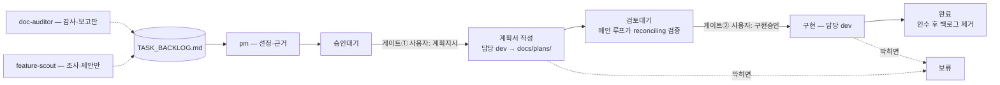

# PROJECT_BOARD

> PM 에이전트가 TASK_BACKLOG.md에서 오늘 처리할 1~2개를 골라 여기에 "승인대기"로 기록한다.
> 단, 미결(`완료`·`보류`가 아닌 것) 항목이 2건 이상이면 새로 기록하지 않는다 — 먼저 진행시키거나 그 행을 지운다.
> 새 섹션은 이 안내 블록 바로 아래(최신순)에 들어간다.
>
> status 전이(전진):
> `승인대기`(PM) → `계획지시`(**사용자만**) → `검토대기`(에이전트) → `구현승인`(**사용자만**) → `완료`·`보류`(에이전트)
>
> 반려(**사용자만**, FEAT-09 이후 대시보드 결재함에서도 가능):
> `검토대기` → `계획지시`(되돌리기 — 계획 재작성) · `승인대기`·`검토대기` → `보류`(사유를 `결과:`에 남긴다) ·
> `승인대기`·`검토대기` → **행 제거**(폐기 — 되돌릴 수 없다. 백로그 항목과 이력 행은 남으므로 수동 정리)
>
> 담당 에이전트는 `계획지시`면 `docs/plans/<항목ID>.md`에 계획서만 쓰고 멈춘다.
> `검토대기` 계획서의 검증은 **무편집 클린 패스(새 결함 0건)가 한 번 나오면 끝난 것이다.**
> 재검증은 계획서나 그것이 인용하는 코드가 바뀌었을 때만 돌린다 — FEAT-02에서 클린 패스 뒤에 돌린 4차가 아무것도 못 찾았다.
> **`구현승인`이어야 코드를 고친다.** `완료`로 기록할 때 TASK_BACKLOG.md에서도 그 항목을 제거한다.
> `완료` 기록은 재현 검증 후에 받아들인다: 변경 파일 목록 ↔ 계획서 「고칠 파일」, diff ↔ 「구현 스케치」,
> 검증 명령 직접 재실행, 백로그 제거 확인 — 넷 다 에이전트의 보고가 아니라 직접 본 것이어야 한다.
> `보류`에서 재개할 때는 계획부터 다시 받으려면 `계획지시`, 기존 계획으로 이어가려면 `구현승인`으로 되돌린다.
> 맨 아래 「파이프라인 구조」 섹션은 정적 구조도다 — 상태 기록이 아니며, 미결 계수에 넣지 않는다.

## 2026-08-16
- [x] FEAT-09: `/pipeline` 결재함에 반려 경로 — 게이트 거절을 대시보드에서
  agent: admin-dev
  area: apps/admin
  status: 완료
  근거: 사용자 직접 발주 — pm 경유 없음(소유자 발주로 기록). FEAT-08이 승인(도장)만 만들고 거절 수단을 남기지 않아, 계획 반려·항목 보류·폐기가 전부 대시보드 밖에서만 가능하다(FEAT-01을 내리는 데 실제로 수동 처리가 필요했다). 발주 계약은 TASK_BACKLOG.md의 FEAT-09 항목이 원천 — 거절 세 갈래(되돌리기·보류·폐기)의 구분, FEAT-08 화이트리스트 재사용, 사유 기록, 폐기의 비가역성 취급을 계획 단계에서 판단해야 한다. FEAT-01은 같은 날 보류로 내려 미결은 이 항목 1건이다. **게이트①은 대시보드 도장 버튼으로 열 예정 — FEAT-08 원격 쓰기 경로의 첫 실측을 겸한다.** 계획서는 검증 7라운드 12부류(인용 실측·조립 컴파일·순수 계층 27/27·서버 액션 8/8·UI 사슬 렌더·대비 실측 5.58:1·여집합 열거·Tailwind 방출·독립 교차검토·브리핑 사슬 실행·실제 보드 실행·서버 액션×실제 보드 E2E)를 거쳐 6·7라운드 연속 무편집 클린 패스. 게이트② 결정(2026-08-16): 보류 사유 고정 문구 · 폐기는 보드 행만(백로그는 토스트 안내) · 폐기 잉크 oklch(0.50 0.20 27) 승인 · 되돌리기 재작성은 admin-dev 기존 규칙 위임 · 계획지시·구현승인 반려는 넣지 않음 · **보드 안내 블록에 반려 세 전이를 기재한다(메인 루프가 구현 완료 후 처리)**.
  결과: FEAT-08 도장 옆에 거절 세 갈래(되돌리기·보류·폐기)를 얹었다. `transitions.ts`에 `locateItem` 헬퍼를 추출해 `applyGateTransition`을 동작 보존 리팩터하고, 그 위에 반려 화이트리스트 `REJECT_TRANSITIONS`(bounce 검토대기→계획지시·hold 승인대기·검토대기→보류·discard 승인대기·검토대기→행 제거)와 순수 함수 `rejectActionsFor`·`applyBounceTransition`·`applyHoldTransition`(결과 줄 있으면 교체·없으면 근거 뒤 삽입, 리터럴 슬라이스로 `$` 안전)·`applyDiscard`·`holdResultLine`·`rejectCommitMessage`를 더했다. `commit-transition.ts`는 GET→편집→PUT 왕복을 `commitBoardEdit(makeEdit)`로 추출해 승인·반려가 공유하고 `commitRejectTransition`이 action을 서버에서 화이트리스트로 재검증한다(requireAdmin은 각 export try 밖 최상단 유지). UI는 도장과 형태로 대비되는 여백 펜 메모(평평·산세리프·회색 접힘) `RejectActions`를 신규 작성했고 폐기만 인라인 확인 3동작이다. 신규: src/ui/pipeline-reject.tsx. 수정: src/pipeline/transitions.ts·transitions.test.mjs·commit-transition.ts, src/ui/pipeline-page.tsx. 검증: `npm run check -w apps/admin` 통과(ESLint 0·tsc 0), `npm test -w apps/admin` 95 pass·0 fail(transitions.test.mjs +26: rejectActionsFor·bounce/hold/discard 해피패스·파서 왕복·최소 diff·다중 등장 최신 행만·거부 4사유·`$` 리터럴 삽입·재보류 교체·holdResultLine 고정날짜·rejectCommitMessage 3종; 기존 FEAT-08 12테스트가 리팩터 회귀 가드로 통과). 스케치 대비 분기·조건·리터럴·문구 차이 없음 — 계획 스케치가 언급한 신규 파일명 `reject-transition.ts`는 「고칠 파일」 표대로 `commit-transition.ts` 안 `commitRejectTransition`으로 실현(별도 파일 아님). 재보류 테스트만 기존 BOARD 픽스처의 FEAT-05에 결과 줄을 인라인으로 더해 구성(새 픽스처 없음). 못 덮음(Node 러너·DOM/외부 I/O 없음): commitBoardEdit GET/PUT·base64·sha 409·requireAdmin·commitRejectTransition action 분기, RejectActions useState/useTransition/toast/router.refresh·여백 펜 메모 시각·폐기 확인 잉크 oklch(0.50 0.20 27) 12px AA 실측·마커 3:1·투영 지연 — 배포 후 데스크톱+폰 수동 확인. 비고(읽기 전용/쓰기 범위 밖 → 메인 루프): apps/admin/CLAUDE.md 테스트 수 69→95·transitions.test.mjs 설명에 반려 전이 추가·Common Gotchas "두 전이 외 커밋 불가" 문구 확장, PROJECT_BOARD 안내 블록에 반려 세 전이 기재 여부.
- [x] FEAT-08: `/pipeline` 결재함 게이트 버튼 — 원격 게이트 개방 (승인대기→계획지시, 검토대기→구현승인)
  agent: admin-dev
  area: apps/admin
  status: 완료
  근거: 사용자 직접 발주 — pm 경유 없음(소유자 발주로 기록). 결재함이 승인대기·검토대기 항목을 "결재" 라벨로 보여주면서 결재 수단이 없는 마찰을 소유자가 실사용에서 확인(FEAT-01 13일 대기 관측 중), 원격 게이트 개방을 결정. 발주 계약은 TASK_BACKLOG.md의 FEAT-08 항목이 원천(불변식 논거·전이 화이트리스트·스테일 가드·성격 변경 명시 포함). FEAT-01보다 먼저 수행하기로 사용자가 지정(2026-08-16). 미결 2건이 되므로 pm 신규 선정은 이 항목 정리 전까지 멈춘다. 계획서는 검증 5라운드(인용 실측·조립 컴파일·명세 테스트 8/8·서버 액션 모의 실행 6/6·대비 실측·Tailwind 방출·여집합 열거·독립 교차검토·UI 사슬 렌더)를 거쳐 4·5라운드 연속 무편집 클린 패스. 게이트② 결정(2026-08-16): pipeline-run 자동 게시 안 넣음 · "결재" 칩 제거 · 임프린트+어두운 잉크(oklch(0.50 0.12 62), 5.20:1) · CDN 잔상 raw 유지 — 전부 계획서 기본값 그대로.
  결과: 결재함 카드의 정적 "결재" 칩을 도장 임프린트 게이트 버튼으로 승격했다 — 전이 화이트리스트(승인대기→계획지시·검토대기→구현승인)와 status 줄만 교체하는 스테일 가드 순수 함수(`applyGateTransition`, 원본 문자열 인덱스 슬라이스로 최소 diff 보장)·커밋 메시지 빌더를 `transitions.ts`에 두고, contents API 왕복(GET로 HEAD sha·PUT로 sha 낙관적 잠금)만 새 서버 액션 `commit-transition.ts`(requireAdmin 뒤·사유별 실패 문구)에 담았다. DB 무접근 유지, 새 외부 쓰기는 GitHub 콘텐츠 하나뿐. 신규: src/pipeline/{transitions.ts, transitions.test.mjs, commit-transition.ts}, src/ui/pipeline-gate.tsx. 수정: src/pipeline/github.ts(BOARD_PATH·BOARD_CONTENTS_URL 상수), src/ui/pipeline-page.tsx(InboxCard 칩→GateTransitionButton), src/env.js(토큰 주석만·스키마 불변). 검증: `npm run check -w apps/admin` 통과(ESLint 0·tsc 0), `npm test -w apps/admin` 69 pass·0 fail(transitions.test.mjs 12 신규: 화이트리스트+프로토타입 오염·파서 왕복·최소 diff·다중 등장 최신 행만·거부 4사유·커밋 메시지 2종). 스케치 대비 차이 없음(분기·조건·리터럴·문구 모두 구현 스케치대로). 못 덮음(Node 러너·DOM/외부 I/O 없음): commit-transition의 contents API GET/PUT·base64·sha 409 분기·requireAdmin 게이트·토큰 미설정, GateTransitionButton의 useTransition·toast·router.refresh·도장 임프린트 시각(테두리·hard 그림자·hover 들림·active 눌림)·라벨 잉크 5.20:1 실화면·세리프 폴백(폰), 투영 지연(raw CDN 잔상 — 커밋 성공 후 잠시 결재함에 남을 수 있음, 성공 토스트가 결과 확정) — 배포 후 데스크톱+폰 수동 확인. 런타임 전제(코드 밖): PAT에 Contents RW 추가 재발급 필요(현재 Issues RW만이면 커밋 PUT 실패). 비고: apps/admin/CLAUDE.md는 읽기 전용이라 테스트 표에 transitions.test.mjs 행 추가·파일 수 7→8·테스트 수 57→69 갱신과 "외부 쓰기는 하나뿐"→두 경로(이슈 코멘트+보드 콘텐츠 커밋) 정정은 메인 루프가 처리한다.

## 2026-08-15
- [x] FEAT-07: `/pipeline` 픽셀 사무실 — Gather풍 그림체 전환 + 캐릭터 고정·상태 말풍선 + 전 책상 명령
  agent: admin-dev
  area: apps/admin
  status: 완료
  근거: 사용자 직접 발주 — pm 경유 없음(소유자 발주로 기록). FEAT-06 그림체가 사용자 판정에서 기각돼(의도는 Gather풍 픽셀) 시안 7회 반복으로 그림체·말풍선·명패·전 책상 명령까지 확정 후 재발주. 승인 시안은 docs/design/FEAT-07/에 저장소 내 계약으로 보존. 계획서는 검증 8라운드(조립 컴파일·lint·테스트 실행·독립 교차검토·실물 렌더·대비 실측 포함)를 통과. 게이트② 결정(2026-08-15): hold색 #9a5a2f 승인 · heldId 칩 유지 · 헤더 비픽셀 유지 · done색 #6f6b64로 조정 — 계획서에 반영됨.
  결과: `/pipeline` 사무실을 픽셀(Gather풍) 그림체로 전환했다 — 격자·팔레트·tone→말풍선색 상수와 gridToRects/resolveCell/appearanceFor/bubbleColorFor 순수 함수를 sprites.ts에 두고 sprites.test.mjs로 덮었다. 캐릭터 외형은 agentId에서만 나오고(PixelSprite, 포즈/tone-채움 시스템 제거), 상태는 머리 위 픽셀 말풍선이 나르며 muted면 말풍선 없음(침묵 규칙). 방 배경(벽·걸레받이·체커 바닥·화분·액자)·책상·명패·소유자 배너를 pixel-office.tsx로 구성해 폰 2열 격자/데스크톱 flex-wrap(가로 스크롤 없음)으로 배치했고, 명령 화이트리스트에 dev 「작업 진행」(admin-work·web-work) 두 키·본문을 더해 5책상 전부 명령을 갖는다(외부 쓰기 경로는 기존 ISSUE_COMMENTS_URL 하나 그대로, DB 무접근 유지). 게이트② 결정 4건 모두 반영(hold #9a5a2f · heldId 칩 유지 · 헤더 비픽셀 유지 · done #6f6b64). 신규: src/pipeline/{sprites.ts, sprites.test.mjs}, src/ui/pixel-office.tsx. 수정: src/ui/{agent-character.tsx(재작성), pipeline-command.tsx(선택적 className), pipeline-page.tsx}, src/pipeline/{commands.ts, commands.test.mjs, desk-commands.ts, desk-commands.test.mjs}. 테스트 총 57 pass·0 fail(sprites 15 신규 + commands 1 신규 + desk-commands 단언 뒤집기), npm run check 통과. commands.ts의 기존 4키 본문은 글자 그대로 보존(pipeline-run 바이트 동일 테스트 통과). 스케치 대비 차이 없음(분기·조건·리터럴·문구 모두 구현 스케치대로, pixel-office.tsx만 스케치 조각들을 임포트 통합해 한 파일로 합침). 못 덮음(Node 러너·DOM/외부 I/O 없음): SVG 렌더·crispEdges 선명도·격자/말풍선/명패 기하·명패 폭 초과·반응형 레이아웃(폰 2열/데스크톱 flex-wrap)·방 배경·명령 버튼 픽셀 스타일·PipelineCommandButton의 useTransition/토스트·postPipelineCommand의 requireAdmin 게이트·GitHub POST — 배포 후 데스크톱+폰 수동 확인 대상. 비고: apps/admin/CLAUDE.md 테스트 표에 sprites.test.mjs 행 추가와 파일·테스트 수 갱신(6→7파일, 41→57테스트)은 그 파일이 읽기 전용이라 수정 범위 밖 — 메인 루프가 처리한다.
- [x] FEAT-06: `/pipeline` 사무실 뷰 — 플랫 SVG 캐릭터·책상 공간화 + 책상별 원격 명령
  agent: admin-dev
  area: apps/admin
  status: 완료
  근거: 사용자 직접 발주 — pm 경유 없음(소유자 발주로 기록). FEAT-04 실사용 관찰(직관성 부족)과 확장성(오케스트레이터 시대의 흐름 시각화, 책상별 명령 앵커)이 근거. "빈 사무실" 반론은 기각됨 — 대기 중인 직원도 상태이며 은유가 희소 상태에서 성립한다. 그림체는 플랫 미니멀 SVG로 사용자 확정.
  결과: `/pipeline`을 사무실 뷰로 공간화했다 — 팀 알약 칩(TeamZone)을 책상 세로 스택(OfficeZone/OfficeDesk)으로 교체해 각 책상에 자세=상태·소품=역할인 플랫 SVG 캐릭터(AgentCharacter: tone→팔 각도 + 상태 채움색)와 heldId 칩·책상별 명령 버튼을 얹고, 결재함을 "당신의 책상"(서류 모티프)으로 리프레임했다. 명령은 순수 화이트리스트(commands.ts `resolvePipelineCommand`의 `Object.hasOwn` 멤버십 검사)를 보안 경계로 두고, desk-commands.ts가 책상→{key,label}만 매핑하며(본문 없음, 클라 노출 안전), 서버(command-action.ts)가 클라가 보낸 key를 화이트리스트로 본문 해석·밖이면 거부한다 — 임의 문자열이 코멘트로 나가는 경로 없음, 이슈 #87 단일 외부 쓰기 경로 유지(DB 무접근). 신규: src/pipeline/{commands.ts, desk-commands.ts, commands.test.mjs, desk-commands.test.mjs}, src/ui/agent-character.tsx. 수정: src/pipeline/{command-action.ts, briefing.ts, briefing.test.mjs}, src/ui/{pipeline-command.tsx, pipeline-page.tsx}. 테스트 8개 추가(commands 5·desk-commands 3) + briefing에 heldId 단언, 총 41 pass·check 통과. 스케치 대비 차이(사용자에게 보이는 문구): (1) teamState의 heldId 분리로 팀 상태 문구가 짧아졌다 — admin-dev "FEAT-04 검토 요청 중"→"검토 요청 중"+heldId, web-dev·보류·완료 4상태에서 ID를 칩으로 뗐고 pm 2문자열("2건 결재 요청 중"·"새 선정 없음")은 그대로. (2) InboxZone 라벨 "결재함"→"당신의 책상"(스케치 지정)에 DocumentsMark 장식 SVG를 헤더에 추가 — 스케치가 "구조·리터럴 요점(겹친 사각형·stroke=currentColor·fill-card·aria-hidden)"만 준 대로 헬퍼로 채웠다(분기·조건·화이트리스트 리터럴은 스케치와 동일, pipeline-run 본문은 기존 COMMAND_BODY와 글자 그대로 동일·테스트 단언). 못 덮음(Node 러너·DOM/외부 I/O 없음): AgentCharacter SVG 렌더·포즈 기하(팔 각도·소품 위치)·fill-*/stroke 시각 결과·상태별 채움색, OfficeZone/OfficeDesk·당신의 책상 서류 모티프·모바일 단일 컬럼·transition-transform, PipelineCommandButton의 useTransition·토스트·클릭, postPipelineCommand의 requireAdmin 게이트·GitHub POST·res.ok 분기 — 배포 후 데스크톱+폰 수동 확인 대상. 비고: apps/admin/CLAUDE.md 테스트 표에 commands.test.mjs·desk-commands.test.mjs 2행 추가는 수정 범위 밖이라 메인 루프가 처리한다.

## 2026-08-14
- [x] FEAT-04: `/pipeline` UI/UX 개편 — 결재함·팀·보고 3구역 + 캐릭터 발화 렌더링
  agent: admin-dev
  area: apps/admin
  status: 완료
  근거: 사용자 직접 발주 — pm 경유 없음(소유자 발주로 기록). FEAT-03 화면이 데이터 덤프로 나온 원인이 발주문의 디자인 기준 부재였으므로, 이번 백로그 source에 구조·렌더링 기준을 명시해 재발주한다.
  결과: `/pipeline`을 3구역 브리핑(결재함·팀 현황·보고)으로 재작성했다 — 보드 상태를 캐릭터 발화로 결정적 매핑하는 순수 계층을 두고, UI는 단일 컬럼(`max-w-2xl`) 말풍선·칩·네이티브 `
` 피드로 렌더한다. 같은 ID가 여러 섹션에 있으면 최신 행만 남기는 dedupe를 `flatten`에 넣어 끝난 항목의 옛 승인대기 행이 결재함에 되살아나지 않게 했다. 신규: src/pipeline/{agents.ts, briefing.ts, briefing.test.mjs}, src/ui/agent-avatar.tsx. 수정: src/app/pipeline/page.tsx(buildBriefing 주입·bg-briefing), src/ui/pipeline-page.tsx(재작성), src/ui/pipeline-command.tsx(버튼·토스트 한국어화), src/styles/globals.css(stamp/stamp-soft/active/silence/hold/briefing 토큰 + 디스플레이 세리프·한글 폴백 서체). briefing.test.mjs 18테스트 추가(총 33 pass, check 통과). 스케치 대비 차이: 결재함 detail의 `
` 라벨 "근거 보기"는 스케치가 미지정이라 새로 정했고, UI 파일은 계획이 "구조·리터럴 요점"만 준 대로 헬퍼 컴포넌트로 나눠 채웠다(리터럴·분기·문구는 스케치와 동일). 못 덮음(Node 러너·DOM 없음): React 렌더·`
` 펼침·line-clamp·group-open·새 색토큰/서체의 시각 결과·모바일 레이아웃·`requireAdmin()` 게이트·`getPipelineBoard()` fetch·`postPipelineCommand` 액션·토스트 — 배포 후 폰 수동 확인 대상. 런타임 전제(구현 밖): 한글 세리프 정체성은 데스크톱(바탕)에서만 온전하고 폰(iOS·Android)에선 고딕 폴백된다(계획 「타이포 역할」 기기 현실). apps/admin/CLAUDE.md 테스트 표에 briefing.test.mjs 행 추가는 수정 범위 밖이라 메인 루프가 처리한다(비고 참조).
- [x] FEAT-03: 파이프라인 대시보드 — 보드 카드 뷰 + 원격 명령 버튼
  agent: admin-dev
  area: apps/admin
  status: 완료
  근거: 사용자 직접 발주 — pm 경유 없음(pm의 하루 1회 규칙과 무관한 소유자 발주로 기록한다). 검증된 리모컨(이슈 #87 → webhook 루틴) 위에 카드형 화면과 명령 버튼을 얹는 3단계 시각화 작업.
  결과: `/pipeline` 라우트를 추가했다 — dev 브랜치 PROJECT_BOARD.md를 raw로 no-store fetch해 순수 파서(board.ts)로 카드 렌더하고, "Run pipeline" 버튼이 서버 액션으로 이슈 #87에 코멘트를 POST한다. 신규: src/pipeline/{github.ts, board.ts, board.test.mjs, queries.ts, command-action.ts}, src/ui/{pipeline-page.tsx, pipeline-command.tsx}, src/app/pipeline/page.tsx. 수정: src/env.js(GITHUB_PIPELINE_TOKEN optional 추가). board.test.mjs 4테스트 추가(총 15 pass). 못 덮음(Node 러너·DOM/외부 I/O 없음): queries.ts의 raw fetch, command-action.ts의 코멘트 POST, requireAdmin 게이트, React 렌더·useTransition·toast — 배포 후 수동 확인 대상. 런타임 전제(구현 밖): GITHUB_PIPELINE_TOKEN 값 주입은 사용자 몫이며 반드시 저장소 소유자(Sangeok) 계정 토큰이어야 루틴이 코멘트를 인식한다(아니면 POST는 성공해도 루틴이 무시하는 조용한 실패). apps/admin/CLAUDE.md 문서 3행 갱신은 계획 「비고」대로 메인 루프가 처리한다(수정 범위 밖).
- [x] BUG-06: pricing FAQ가 부분 생성 시 크레딧 미차감이라고 안내하지만 실제로는 생성분만큼 차감됨
  agent: web-dev
  area: apps/web/src/fsd/pages/pricing/config
  status: 완료
  근거: 미결 1건(FEAT-01)이라 규칙상 오늘은 1건만 선정한다. BUG-06은 web-dev 범위의 고객 대면 문구가 실제 크레딧 차감 동작과 모순되는(약관과 FAQ가 서로 어긋난) 정합성 결함이라 이를 고른다.
  결과: pricingFaq의 두 답변("How does the free trial work?", "When are credits deducted?")을 실제 차감 동작(clipsFound===0 미차감, clipsFound>=1이면 생성분만큼 차감, 에러로 끝난 부분 생성도 차감)에 맞게 교체했다. 이 배열은 FAQ 화면 렌더와 schema.org JSON-LD 양쪽이 읽으므로 파일 하나로 두 표면에 반영된다. 수정: apps/web/src/fsd/pages/pricing/config/index.ts. 정적 카피 교체라 추출할 순수 함수가 없어 테스트는 추가하지 않았다(문구↔차감 로직 정합성은 사람 대조로 검증). 범위 밖: 같은 낡은 주장이 README.md:198-199·README.ko.md:345에 남아 있으나 web-dev 범위(apps/web/src/**) 밖이라 별도 처리 필요.

## 2026-08-06
- [x] FEAT-02: 업로드 영상 길이에 맞춰 클립 개수 기본값 제안
  agent: web-dev
  area: apps/web/src/fsd/pages/dashboard + apps/web/src/fsd/shared/config
  status: 완료
  근거: 미결 1건(FEAT-01)이라 규칙상 오늘은 1건만 선정한다. 백엔드 항목(BUG-02~04)은 담당 에이전트가 없어 제외되고, 선정 가능한 신규 web 항목은 실사용 관찰에서 올라온 FEAT-02뿐이라 이를 고른다.
  결과: 소스 재생 길이로 구조적 상한을 계산하는 순수 함수와 경계값 테스트를 추가하고, 업로드 UI가 드롭 시 길이를 읽어 상한 초과 개수 옵션 비활성화·선택값 하향 클램프·안내 문구·상한 0일 때 업로드 차단을 하도록 수정했다. 수정: apps/web/src/fsd/pages/dashboard/model/clip-count-budget.ts(신규), clip-count-budget.test.mjs(신규), ui/_component/UploadPodcast.tsx. 계획이 우려한 `~` 별칭은 테스트 러너에서 정상 해석돼 파라미터화 폴백은 불필요했다. 못 덮음: DOM `<video>` 측정과 컴포넌트 렌더/클램프/비활성화/안내(Node 러너에 DOM 없음), 백엔드 하이라이트 미달 생성(apps/backend 소관).

## 2026-08-03
- [ ] FEAT-01: Credit System 마무리
  agent: web-dev
  area: apps/web/src/fsd/features/billing + apps/web/src/fsd/entities/user + apps/web/src/inngest
  status: 보류
  근거: 현재 "개발 중" 상태로 남아 결제 흐름의 기반이 되는 항목. 결제 자체는 Polar로 이미 동작하므로, 크레딧 시스템을 완성해야 후속 작업이 안정적으로 얹힌다.
  결과: 사용자 결정(2026-08-16) — 지금은 착수하지 않는다. 13일간 게이트① 앞에 머물렀고, 소유자의 현재 초점이 파이프라인 도구(FEAT-07·08 계열)에 있어 우선순위가 맞지 않는다. 폐기가 아니라 대기다 — TASK_BACKLOG.md에 그대로 남으므로 나중에 pm이 다시 선정하거나 소유자가 직접 발주할 수 있다. 재개하려면 이 행을 `계획지시`로 되돌린다(보드 안내 블록의 보류 재개 규칙).

## 파이프라인 구조

정적 구조도다 — 작업 상태의 진실은 위 날짜 섹션들이고, 여기에는 개별 항목이 등장하지 않는다. 절차 전체는 루트 `CLAUDE.md`(런북) 참조.

